# Project work 3

This document aims to describe the work done during week ten, which, as the previous two weeks, consisted in bringing together all the principles and techniques of software engineering that we had learnt, and use them to complete an issue, test it, solve the comments it received, and finally review someone else's code.

---
<br>

## My issue

After having a look through the list of issues provided by the professor I decided to pick the one in figure 1. It was quite similiar to the one fom last week but had a slight difference:

<figure>
  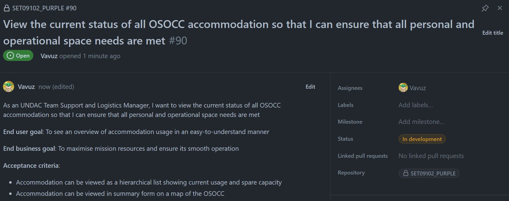
  <figcaption align="center" style="font-size:11px;"><b>Fig.1 - My issue</b></figcaption>
</figure>

The aim of this issue (https://github.com/xinjoonha/SET09102_PURPLE/issues/90) is to create a UI that will allow an UNDAC Team Support member and a Logistic Manager to view a list of all the available accommodations around the world and see their status (how full they are). Specifically there were two acceptance criteria:
- All the accommodations should be displayed in a list in a **hierarchical order** and show the **capacity** in an easy-to-understand way. Since the criteria about ordering the items was not specific, I decided to order them from emptiest to fullest and the capacity is shown as a ratio, like `5/12`, which is really easy to understand. 
- The accommodations should be put together in a **map file that can be downloaded and viewed** for an easier visual representation of the data. According to the aims and values of the whole group project idea, this is not meant to be actually working, so a simulation would be more than enough.
<br><br>

## The code

Exactly like in the past two weeks, the implementation consisted in 3 main steps, so I will not show the same code of the previous two portfolios as that would be repetitive but I will only show the differences, starting with the model. This time I included a variable called `SpaceUsageFormatted` that is self assigned, so it doesn't have to be assigned in the code but it is very useful for displaying the ratios to the UI:

```cs
[Table("accommodation")]
public class Accommodation : IIdentifiable
{
    [PrimaryKey, AutoIncrement]
    public int Id { get; set; }
    public string Name { get; set; }
    public int UsedSpace { get; set; }
    public int TotalSpace { get; set; }
    public string SpaceUsageFormatted => $"{UsedSpace} / {TotalSpace}";
}
```

The second difference can be spotted in the `AllAccommodationsPage` class. Despite it being the same as the one from week 9 it has a new method that we haven't seen before. `DownloadFile()` was meant to manage the download of the OSOCC map, but since I was not able to do it (I explained why in the reflection section at the end) it simply became a method that once a button is clicked, opens a link to an image of an hypothetical OSOCC accommodations map:

```cs
private async void DownloadFileClicked(object sender, EventArgs e)
{
    Uri uri = new Uri("https://www.researchgate.net/publication/307576584" +
                      "/figure/fig2/AS:408535839068161@1474413942986/Number-of-users-and-" +
                      "number-of-events-in-the-Virtual-OSOCC-Country-colors-indicate-the.png");
    await Browser.Default.OpenAsync(uri, BrowserLaunchMode.SystemPreferred);
}
```

Finally the third difference was in the `EditAccommodationPage` class. In fact this time I had to implement some more data validation. The number of taken spaces had to obviously be lower than the number of total spaces, and there also was the usual whitespace or null check as you can see:

```cs
public async void OnConfirmClicked(object sender, EventArgs e)
{
    if (string.IsNullOrWhiteSpace(NameEntry.Text) ||
        string.IsNullOrWhiteSpace(UsedEntry.Text) ||
        string.IsNullOrWhiteSpace(TotalEntry.Text) ||
        !int.TryParse(UsedEntry.Text, out _) ||
        !int.TryParse(TotalEntry.Text, out _))
    {
        await DisplayAlert("Error", "One of the fields is invalid", "OK");
        return;
    }

    var usedSpace = int.Parse(UsedEntry.Text);
    var totalSpace = int.Parse(TotalEntry.Text);

    if (usedSpace > totalSpace)
    {
        await DisplayAlert("Error", "The used spaces can't be more than the total available spaces!", "OK");
        return;
    }

    // Accommodation is null if we are creating one
    accommodation ??= new Accommodation();

    accommodation.Name = NameEntry.Text;
    accommodation.UsedSpace = usedSpace;
    accommodation.TotalSpace = totalSpace;

    await _accommodationsRepo.SaveAsync(accommodation);
    await Navigation.PopAsync();
}
```

I think it is essential to show the UI that came out from my code as I think it is quite pleasing to the eye, and that is also why we chose it as our standard CRUD operations UI. Figure 2 shows it:

<figure>
  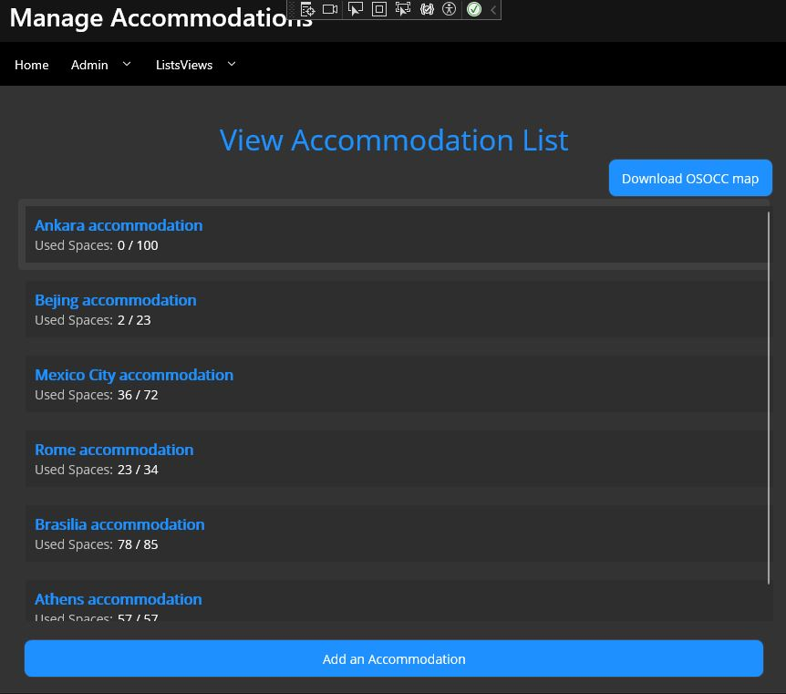
  <figcaption align="center" style="font-size:11px;"><b>Fig.2 - CRUD UI</b></figcaption>
</figure>
<br><br>

## The tests

Using the last week's test as guideline, I managed to write a few tests for our new Accommodation object. The tests are really similar to last weeks', but I decided it was a good idea to check different possible invalid values that the input fields could receive. Following is `AccommodationCrudTests` the class:

```cs
[TestFixture]
public class AccommodationCrudTests
{
    private UndacDatabase _database;
    private string testDatabasePath;
    private IAccommodationRepository repo;

    [OneTimeSetUp]
    public async Task OneTimeSetUpAsync()
    {
        // Create a test database file path within your unit test project
        testDatabasePath = Path.Combine(TestContext.CurrentContext.TestDirectory, "TestFiles", "TestDB.db3");

        // Create an instance of UndacDatabase using the test database path
        _database = new UndacDatabase(testDatabasePath);
        await _database.Init();
        repo = new AccommodationRepository(_database.Database);
    }

    [OneTimeTearDown]
    public void TearDownA()
    {
        Directory.Delete(testDatabasePath);
    }

    [Test]
    public async Task AddAccommodationTestAsync()
    {
        var testAccommodation = new Accommodation
        {
            Name = "Bejing accommodation",
            UsedSpace = 8,
            TotalSpace = 34
        };
        await repo.SaveAsync(testAccommodation);

        Accommodation readAccommodation = await repo.GetAsync(testAccommodation.Id);
        Assert.That(readAccommodation, Is.Not.Null, " Test Accommodation was not saved");
        Assert.That(readAccommodation.Name, Is.EqualTo(testAccommodation.Name), " Test Accommodation name not matching");
    }

    [Test]
    public async Task AddInvalidNameAccommodationTestAsync()
    {
        var testAccommodation = new Accommodation
        {
            Name = "",
            UsedSpace = 1,
            TotalSpace = 3
        };
        await repo.SaveAsync(testAccommodation);

        Accommodation readAccommodation = await repo.GetAsync(testAccommodation.Id);
        Assert.That(readAccommodation, Is.Null, " Test Accommodation was saved");
    }

    [Test]
    public async Task AddInvalidSpaceUsageAccommodationTestAsync()
    {
        var testAccommodation = new Accommodation
        {
            Name = "Milan accommodation",
            UsedSpace = 8,
            TotalSpace = 3
        };
        await repo.SaveAsync(testAccommodation);

        Accommodation readAccommodation = await repo.GetAsync(testAccommodation.Id);
        Assert.That(readAccommodation, Is.Null, " Test Accommodation was saved");
    }

    [Test]
    public async Task DeleteAccommodationTestAsync()
    {
        var testAccommodation = new Accommodation
        {
            Name = "Sidney accommodation",
            UsedSpace = 4,
            TotalSpace = 58
        };
        await repo.SaveAsync(testAccommodation);

        await repo.DeleteAsync(await repo.GetAsync(testAccommodation.Id));
        var readAccommodationTwo = await repo.GetAsync(testAccommodation.Id);

        Assert.That(readAccommodationTwo, Is.Null, " Test Accommodation was not deleted");
    }

    [Test]
    public async Task GetAccommodationTestAsync()
    {
        var testAccommodation = new Accommodation
        {
            Name = "Moscow accommodation",
            UsedSpace = 98,
            TotalSpace = 105
        };
        var testAccommodationTwo = new Accommodation
        {
            Name = "Brasilia accommodation",
            UsedSpace = 58,
            TotalSpace = 58
        };
        await repo.SaveAsync(testAccommodation);
        await repo.SaveAsync(testAccommodationTwo);

        var accommodationtList = await repo.GetAllAsync();
        var accommodationOne = accommodationtList.FirstOrDefault(accommodation => accommodation.Name == testAccommodation.Name);
        var accommodationTwo = accommodationtList.FirstOrDefault(accommodation => accommodation.Name == testAccommodationTwo.Name);

        Assert.That(accommodationOne.Name, Is.EqualTo(testAccommodation.Name), "The first test accommodation was not retrieved");
        Assert.That(accommodationTwo.Name, Is.EqualTo(testAccommodationTwo.Name), "The second test accommodation was retrieved");
    }
}
```

As you can see I tested for a whitespace as input, in `AddInvalidNameAccommodationTestAsync()`, but I also tested my logic for checking whether the used space value is smaller or equal than the total space value, in `AddInvalidSpaceUsageAccommodationTestAsync()`.
<br><br>

## The review

Once again I received a good amount of comments under my pull request (https://github.com/xinjoonha/SET09102_PURPLE/pull/91) this week. Let's look at them, figure 3 shows the first one:

<figure>
  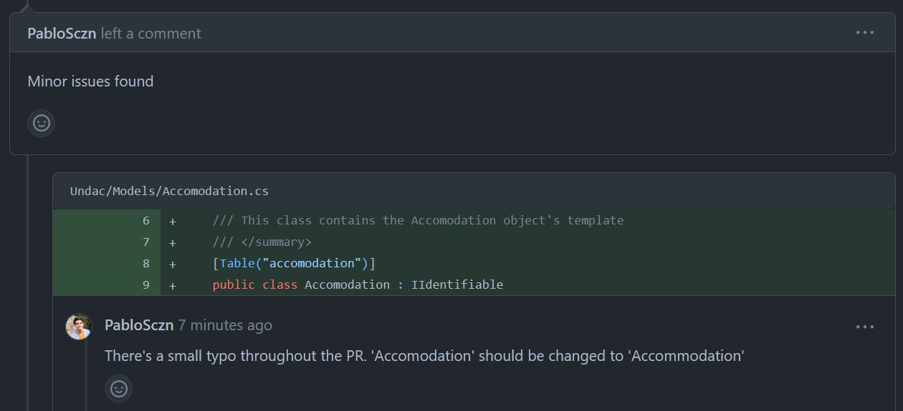
  <figcaption align="center" style="font-size:11px;"><b>Fig.3 - First comment</b></figcaption>
</figure>

As Pablo highlighted, I made a **spelling mistake**. Unfortunately this was not only on the line that he replied to, but in the whole project, in every folder, file, class and method names. This shows that mistakes are always behind the corner and, as a foreigner, these things can sometimes happen, I was in fact convinced that the spelling for accommodation was "accomodation".

<figure>
  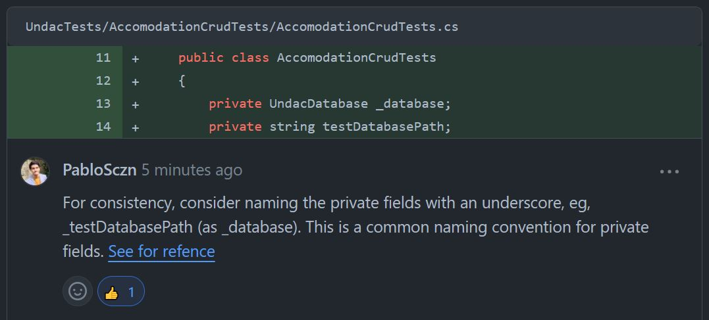
  <figcaption align="center" style="font-size:11px;"><b>Fig.4 - Second comment</b></figcaption>
</figure>

In figure 4 above we can see that it is suggested to use the **underscore symbol on private fields**. Once again I was convinced that the underscore only applied to private readonly fields, but after reading the Microsoft documentation I realised that it did not. Even when you are sure you know a thing there can always be something you are missing, programming is a never-ending learning process!

<figure>
  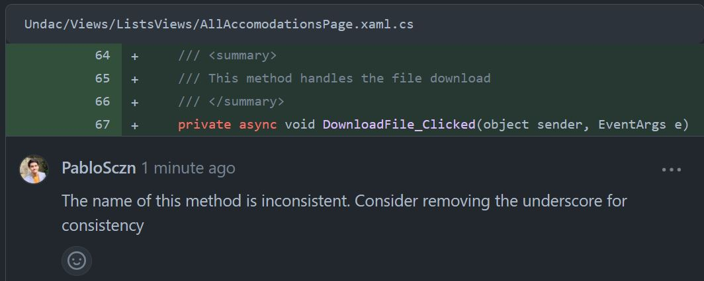
  <figcaption align="center" style="font-size:11px;"><b>Fig.5 - Third comment</b></figcaption>
</figure>

Above we can see a simple **naming consistency** issue, a code smell that must be fixed for the codebase to look neat. I simply renamed the 2 methods that weren't consistent and pushed my code.

---
<br><br>

## My code review

Also this week I think I managed to spot some interesting mistakes and code smells.

<figure>
  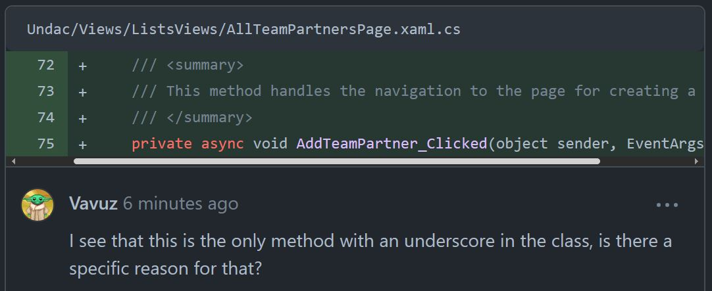
  <figcaption align="center" style="font-size:11px;"><b>Fig.6 - My comment on standards</b></figcaption>
</figure>

To start we can look at the comment in figure 6 and notice that it is very similar to the one I got. In fact, like it happened last week, I just took something that I learnt and used it to address someone else's mistake. Normally methods, unless they are test methods, should not have underscores; if all methods had an underscore I might have been fine with it, but since the other methods did not have underscores there was a discrepance that needed to be pointed out.

<figure>
  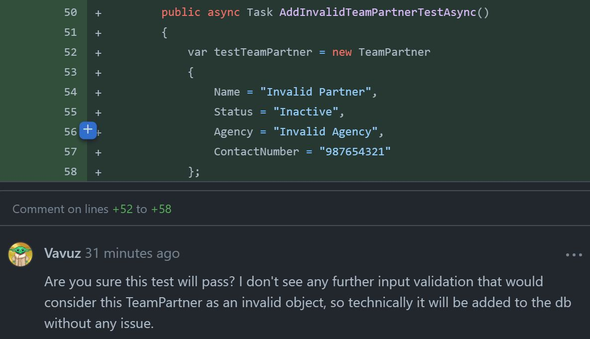
  <figcaption align="center" style="font-size:11px;"><b>Fig.7 - My comment on tests</b></figcaption>
</figure>

Figure 7 shows a pretty interesting comment on a test. Despite the test being supposed to insert an invalid object into the database I had a look at the `EditTeamPartner` class and there is no kind of validation other than the standard null or whitespace one. This means that `SaveAsync()`, which is run immediatly after, would perfectly work, instead of failing, which is what we would expect.

<figure>
  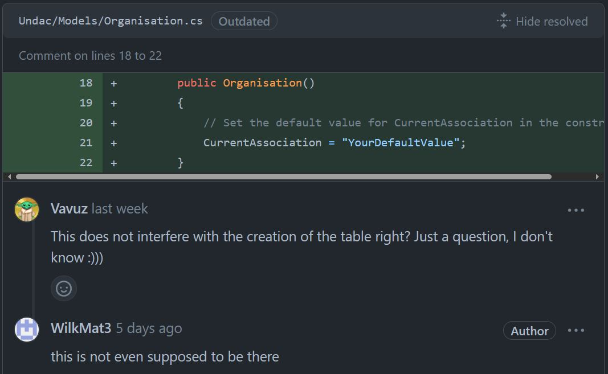
  <figcaption align="center" style="font-size:11px;"><b>Fig.8 - My comment on model</b></figcaption>
</figure>

This comment is different from the others because I thought there was something wrong but wasn't exactly sure about it. I asked my friend if he could confirm my theory that that particular constructor, in the Model class, could interfere with the creation of the table in the database or with other db operations or even with the project build. He told me it wasn't supposed to be there and removed it, but I did not actually find out whether it was an issue or not.

<figure>
  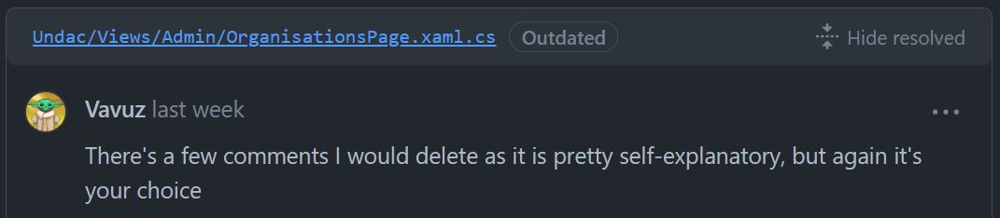
  <figcaption align="center" style="font-size:11px;"><b>Fig.9 - My comment on comments</b></figcaption>
</figure>

Finally this simple comment above states that a few "useless" comments were spotted and that they could have been removed, I also said that it was not for me to choose, as someone might find a comment useful while somebody else might find it superfluous. An example is shown below:

<figure>
  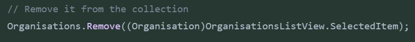
  <figcaption align="center" style="font-size:11px;"><b>Fig.10 - Comment example</b></figcaption>
</figure>

---
<br><br>

## Reflection

Let's now take into considerations the outcomes of all this hard work and my thoughts on the module progress:
- During the previous weeks I often had to look up things I did not know on google and I was also always unsure about where to start and what to do, but after doing these tasks a few times I can now complete my work more or less fluently, this demonstrates how true it is that **practicing is the best way to learn**.
- Not only it is easier to put the issues' acceptance criteria into practice and create a working program, but it is also **easier to implement the various tests**, as we now are all quite keen on it and know how to test the features.
- We finally started **merging some pull requests to main**, before we never did because the team members prefered to work on their code in their branch, write the portfolio and not bother about merging their code with the rest of the team. But after all our efforts to make the merging easier we did it.<br>
The only issue was that there were a lot of merge conflicts, but that was simply because main started becoming very outdated, now it is keeping up with the pace and the future merge conflicts will be an easier fix.<br>
The first ones to be merged were actually mine, specifically one was mine and one was mine and Mateusz's (my pair programming buddy), below is an image of the Github Network:

<figure>
  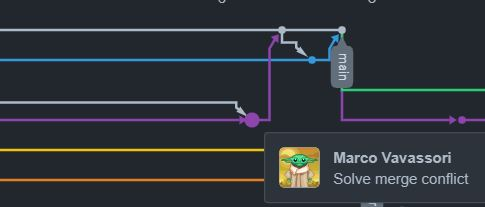
  <figcaption align="center" style="font-size:11px;"><b>Fig.11 - Merging PRs</b></figcaption>
</figure>

- We were told that our application was not meant to be actually working but I still tried my best to satisfy the acceptance criteria of the ticket as much as possible, all the time. Unfortunately this time I couldn't as my aim was to allow the user to download a file from the UI but to do so I needed the `CommunityToolkit` so I could import a service called `IFileSaver` to help me with the task, but installing it required a project with dotnet 7 and our has dotnet 6 because of some issues we had in the past weeks. I replaced the download with a link to an online image, so **I did not fully satisfy the AC**, but I delivered a working product.
- There is still is **a major problem** with this team task: there is always a few members of the team which do not interact with the rest of the team, they do not offer their help with giving and asking for reviews and this penalises every single member, since it makes it harder to find material to provide in the portfolio. 
- There are also **some minor problems**, for example some team members do not create an issue for their task or create empty issues, this makes it harder to pick a task to work on and sometimes it also leads to more people doing the same ticket. Hopefully this avoidable mistakes won't be happening by the end of the trimester.
- I am overall quite proud of myself, the team project is going great and I see improvements every week, not only in myself, but also in **my teammates** who keep getting better at writing clean code and giving useful reviews.