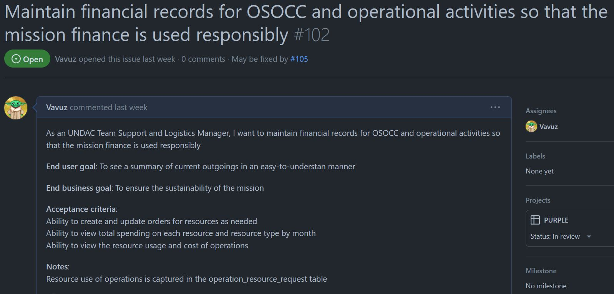
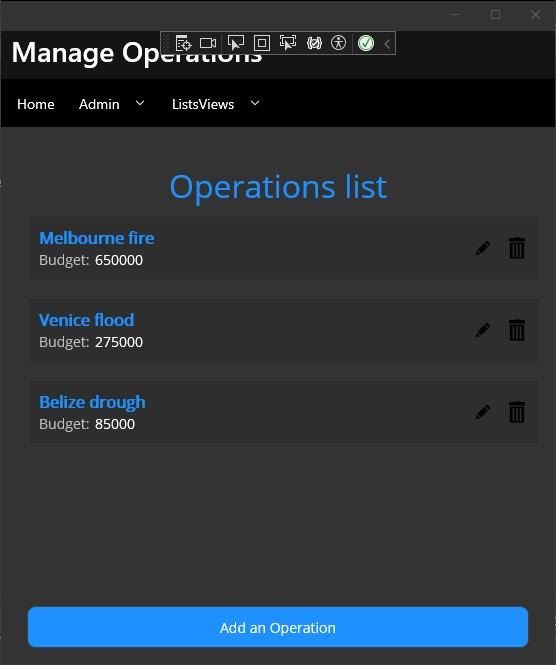
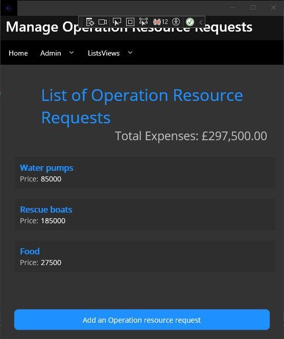
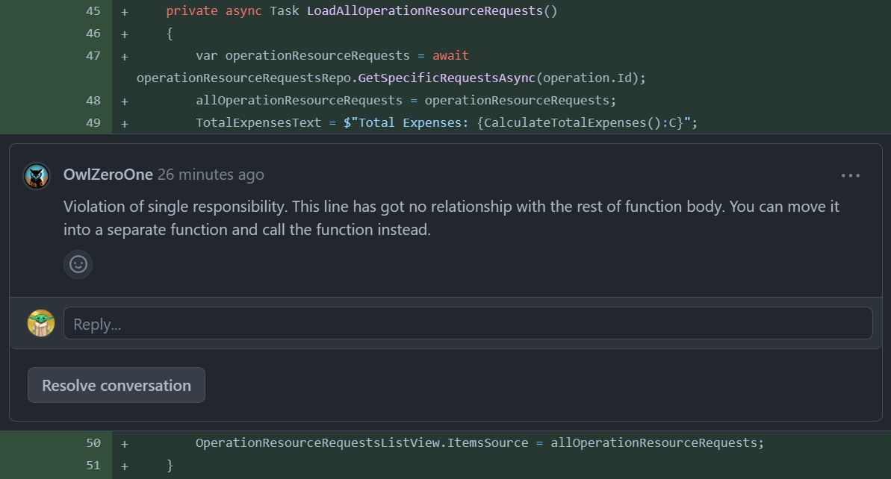
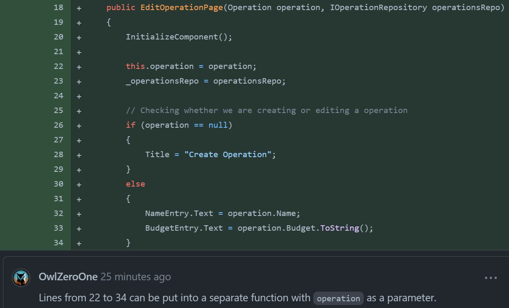
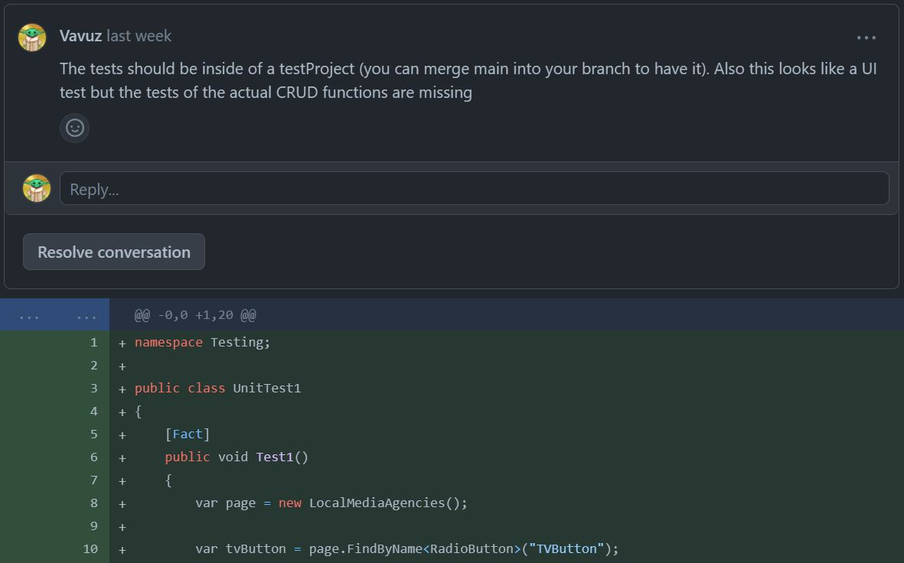
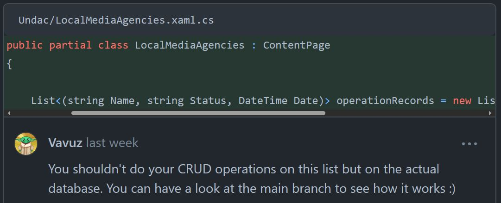
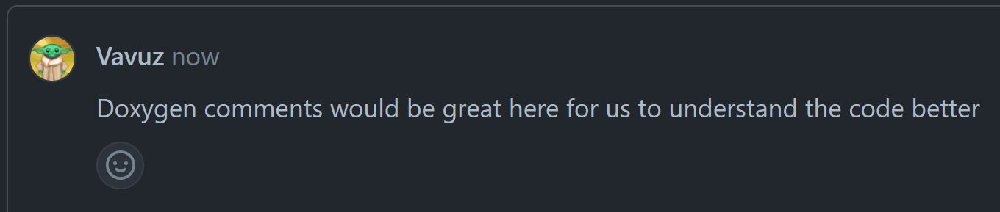

# Project work 4

This document aims to describe the work done during week eleven, which, as the previous three weeks, consisted in bringing together all the principles and techniques of software engineering that we had learnt, and use them to complete an issue, test it, solve the comments it received, and finally review someone else's code.

---
<br>

## My issue

he issue I decided to pick was the one in figure 1. It was more complicated than last week's as it had a crud ui inside a crud ui, and as it had an updating ui element (total price):

<figure>
  
  <figcaption align="center" style="font-size:11px;"><b>Fig.1 - My issue</b></figcaption>
</figure>

The aim of this issue (https://github.com/xinjoonha/SET09102_PURPLE/issues/102) is to create a UI that will allow an UNDAC Team Support member and a Logistic Manager to view a list of all the current OSOCC operations, manage their resource requests and therefore see if they are sustainable or not. Specifically there were three acceptance criteria:
- You should be able to **create and update the resource requests** via a simple CRUD UI.
- The **total expenses** of the resources should be visible and they can be **filtered them by month**. Unfortunately I was not able to add a date attribute and filter them by month.
- It should be possible to view the **cost of each operation and the usage of the resources**, which I interpreted as a total of the resources' expenses.
<br><br>

## The code

This week my model was slightly different, actualy my models. In fact I created a model that has an attribute which is a list of items of the other model. I also created a foreign key in the submodel to link the two as you can see below:

```cs
[Table("operation")]
public class Operation : IIdentifiable
{
    [PrimaryKey, AutoIncrement]
    public int Id { get; set; }
    public string Name { get; set; }
    public decimal Budget { get; set; }
    [OneToMany]
    public List<OperationResourceRequest> Requests { get; set; }
}

[Table("operation_resource_request")]
public class OperationResourceRequest : IIdentifiable
{
    [PrimaryKey, AutoIncrement]
    public int Id { get; set; }
    public string Name { get; set; }
    public decimal Price { get; set; }
    [ForeignKey(typeof(Operation))]
    public int OperationId { get; set; }
}
```

My repository for the `OperationResourceRequests` has a method to find the requests that are link to a specific operation as the snippet shows:

```cs
public class OperationResourceRequestRepository : Repository<OperationResourceRequest>, IOperationResourceRequestRepository
{
    public OperationResourceRequestRepository(SQLiteAsyncConnection database) : base(database){}

    public async Task<List<OperationResourceRequest>> GetSpecificRequestsAsync(int operationId)
    {
        return await database.Table<OperationResourceRequest>().Where(request => request.OperationId == operationId).ToListAsync();
    }
}
```

Finally the last thing I would like to show is my `AllOperationsPage` class which also has an edit and a delete icon, as you can see in figure 2, and their logic is stored in the two short methods below:

```cs
private async void OnEditIconClicked(object sender, EventArgs e)
{
    if (sender is Image image && image.BindingContext is Operation operation)
    {
        await Navigation.PushAsync(new EditOperationPage(operation, operationsRepo));
    }
}

private async void OnDeleteIconClicked(object sender, EventArgs e)
{
    if (sender is Image image && image.BindingContext is Operation operation)
    {
        foreach(OperationResourceRequest request in await operationResourceRequestRepositoryRepo.GetAllAsync())
        {
            if (request.OperationId == operation.Id)
                await operationResourceRequestRepositoryRepo.DeleteAsync(request);
        }

        await operationsRepo.DeleteAsync(operation);
        LoadAllOperations();
    }
}
```

<figure>
  
  <figcaption align="center" style="font-size:11px;"><b>Fig.2 - Operations UI with Edit and Delete</b></figcaption>
</figure>

Clicking on the actual item does not bring you to the edit page like it used to, it now brings you to the other list, the list of resource requests, look below:

<figure>
  
  <figcaption align="center" style="font-size:11px;"><b>Fig.3 - List of Operation resource requests</b></figcaption>
</figure>

## The tests

Once again this week's tests cover a bit more cases, but it is probably because ther are actually two things to test which are the operation itself and its resource requets. Below you can see the most meaningful bits of the `OperationCrudTests` test class, I decided to just include the setup and the insertion of a valid and an invalid operation and operation resource request. Also, as you can see, all my private properties now start with an underscore to adhere to the c# coding conventions:

```cs
[TestFixture]
public class OperationCrudTests
{
    private UndacDatabase _database;
    private string _testDatabasePath;
    private IOperationRepository _operationRepository;
    private IOperationResourceRequestRepository _operationResourceRequestRepository;

    [OneTimeSetUp]
    public async Task OneTimeSetUpAsync()
    {
        // Create a test database file path within your unit test project
        _testDatabasePath = Path.Combine(TestContext.CurrentContext.TestDirectory, "TestFiles", "TestDB.db3");

        // Create an instance of UndacDatabase using the test database path
        _database = new UndacDatabase(_testDatabasePath);
        await _database.Init();
        _operationRepository = new OperationRepository(_database.Database);
        _operationResourceRequestRepository = new OperationResourceRequestRepository(_database.Database);
    }

    [Test]
    public async Task AddOperationTestAsync()
    {
        var testOperation = new Operation { ... }};
        await _operationRepository.SaveAsync(testOperation);

        var readOperation = await _operationRepository.GetAsync(testOperation.Id);

        Assert.That(readOperation, Is.Not.Null, "Test Operation was not saved");
        Assert.That(readOperation.Name, Is.EqualTo(testOperation.Name), "Test Operation name not matching");
    }

    [Test]
    public async Task AddOperationResourceRequestTestAsync()
    {
        var testOperationResourceRequest = new OperationResourceRequest { ... };

        await _operationResourceRequestRepository.SaveAsync(testOperationResourceRequest);

        var readOperationResourceRequest = await _operationRepository.GetAsync(testOperationResourceRequest.Id);

        Assert.That(readOperationResourceRequest, Is.Not.Null, "Test Operation was not saved");
        Assert.That(readOperationResourceRequest.Name, Is.EqualTo(testOperationResourceRequest.Name), "Test Operation name not matching");
    }

    [Test]
    public async Task AddInvalidOperationTestAsync()
    {
        var testOperation = new Operation
        {
            Name = "Invalid Project",
            Budget = -8555,
            Requests = new List<OperationResourceRequest> { }
        };
        await _operationRepository.SaveAsync(testOperation);

        var readOperationResourceRequest = await _operationRepository.GetAsync(testOperation.Id);

        Assert.That(readOperationResourceRequest, Is.Null, "Test Operation was saved");
    }

    [Test]
    public async Task AddInvalidOperationResourceRequestTestAsync()
    {
        var testOperationResourceRequest = new OperationResourceRequest { Name = "Invalid Request", Price = -1000 };

        await _operationResourceRequestRepository.SaveAsync(testOperationResourceRequest);

        Operation readOperation = await _operationRepository.GetAsync(testOperationResourceRequest.Id);
        Assert.That(readOperation, Is.Null, "Test Operation was saved");
    }
}
```

As you can see I tested for a whitespace as input, in `AddInvalidNameAccommodationTestAsync()`, but I also tested my logic for checking whether the used space value is smaller or equal than the total space value, in `AddInvalidSpaceUsageAccommodationTestAsync()`.
<br><br>

## The review

This time I did not receive too many comments under my pull request (https://github.com/xinjoonha/SET09102_PURPLE/pull/105) but I still got two interesting ones which I am going to talk about below.

<figure>
  
  <figcaption align="center" style="font-size:11px;"><b>Fig.4 - Comment on my PR</b></figcaption>
</figure>

OwlZeroOne mentions that this line of coude shown above, should not be there, it should be moved into its own method as it is violating the single responsibility principle. I partly agree with this statement so I decided to move it into its own method:

```cs
private async Task LoadAllOperationResourceRequests()
{
    var operationResourceRequests = await operationResourceRequestsRepo.GetSpecificRequestsAsync(operation.Id);
    allOperationResourceRequests = operationResourceRequests;
    OperationResourceRequestsListView.ItemsSource = allOperationResourceRequests;

    // Update the total in the UI
    UpdateTotalExpenses();
}

private void UpdateTotalExpenses()
{
    TotalExpensesText = $"Total Expenses: {CalculateTotalExpenses():C}";
}
```

<figure>
  
  <figcaption align="center" style="font-size:11px;"><b>Fig.5 - Comment on my PR</b></figcaption>
</figure>

Finally a similar comment, my friend suggests that it would be nice to move those few lines of code into their own method to make it look better and I could not agree more. He even suggested the parameters of the method so I implemented it as requested:

```cs
public EditOperationPage(Operation operation, IOperationRepository operationsRepo)
{
    InitializeComponent();
    this.operation = operation;
    _operationsRepo = operationsRepo;

    // Checking whether we are creating or editing a operation
    UpdateEditingUI(operation);
    
}

private void UpdateEditingUI(Operation operation)
{
    if (operation == null)
    {
        Title = "Create Operation";
    }
    else
    {
        NameEntry.Text = operation.Name;
        BudgetEntry.Text = operation.Budget.ToString();
    }
}
```

---
<br><br>

## My code review

Also this week I managed to spot a few interesting things, a PR in particular was quite bad as the code was not working at all with the sqlite database.

<figure>
  
  <figcaption align="center" style="font-size:11px;"><b>Fig.6 - My comment on project structure</b></figcaption>
</figure>

My teammate added a folder for the tests but he did not add a project for them, nor reutilised the already-existing test project in our repository. Of course that is not right and action needed to be taken before merging it to main. Also I mentioned how he did some UI testing (which was not required but it is okay as it is still a type of test that tests features), while the tests for the CRUD operations are completely missing, and that goes against our workflow.

<figure>
  
  <figcaption align="center" style="font-size:11px;"><b>Fig.7 - My comment unused sqlite</b></figcaption>
</figure>

My teammate probably did not really understand how to work with SQLite, in fact insted of accessing the `Repository` class to add and delete stuff from the database he simply created a list in the code-behind class and added/removed stuff from it. That is okay as CRUD operations are actually being done, but they are not being done on the database itself, so merging this pull request would be absolutely forbidden.

<figure>
  
  <figcaption align="center" style="font-size:11px;"><b>Fig.8 - My comment on doxygen</b></figcaption>
</figure>

Finally I mentioned that Doxygen comments would have looked good on the code not only because it is part of our workflow but also because I was not 100% sure about what the code was doing.

---
<br><br>

## Reflection

- There were a few **interesting pull requests**: one about MVVM pattern and one about about a XAML builder made using the builder design pattern. We managed to merge a few more pull requests but we are also having more conflicts and issues as too many of us want to add stuff to main to make things easier for the team, but since there is not a lot of time to work on it, it is impossible for everyone to adapt.
- The ticket this week was very challenging but I consider myself **satisfied with the results**. I did not complete half of the acceptance criteria but that was because I did not have enough time and because I found it really difficult, specially the "visualise if the mission is sustainable in a easy way" part, which was probably the most important one of the 4. I tried many times but it is so difficult to display something to the UI that is not an attribute in a model but something calculated in the code-behind class. I tried to create an attribute in the model described by the `Ignore` attribute, but despite different attempts I could not make it work. After searching for a solution for days I noticed that very often viewModel was mentioned.
- **ViewModel** is apparently the best way to organise your code and your views, also thanks to it you can do in an easy way what would be extremely difficult to do with code-behind. And that is what I talked about in the previous bullet point: displaying something to the UI that is not contained in the model. Perhaps next week's task could be to **improve this ticket** with MVVM, the new injection for the repositories and the sorting by month. This might link to what I said last week about the project, which was that it does not have to be functioning, but in my opinion if we really want to learn as much as we can from this module then it would be a good thing to try and make it functioning.
- Apart from the coding side, this portfolio is really starting to become a stressful thing to do and **not really enjoyable anymore**, I think that one week is not enough for an unexperienced developer like me and my teammates to work properly on a ticket, and by properly I mean completing all the acceptance criteria. Also it is not enough to review someones's code, get some reviews, test everything and last but absolutely not least, learn something new. This module is coming to an end but it would have been better if we had half the sumbissions as they require too much time and effort to be done properly and not somehow.
- Regarding the team there is not much to say: it got smaller and smaller throughout the weeks, which you might think would be a good thing since I have been complaining about it for a long time now, but it is not because the people that left were not really contributing anyways so nothing really changed. Also it does not really matter because me and 3 other teammates have basically been supporting and helping each other all the way through since week 1 so we got used to it. Even though it might not sound nice, this team of 17 people is now a **team of 4 people**.
- Unfortunately a **few people had to leave** the group as the module was becoming a bit too much for them so they joined a new group that our professor made especially for the people that were struggling a bit more than the others. I hope they manage to succeed as they were also part of the few people that at least tried to contribute to the group repository.
- I know the reflection should focus more on my work than on my personal feelings but this is becoming **really tough**, so I can just hope that I manage to deliver great content like I have been doing for the past weeks until the end of the module.