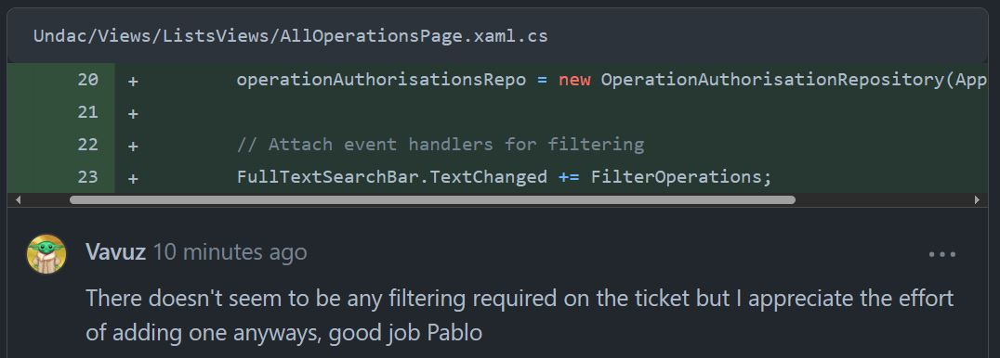
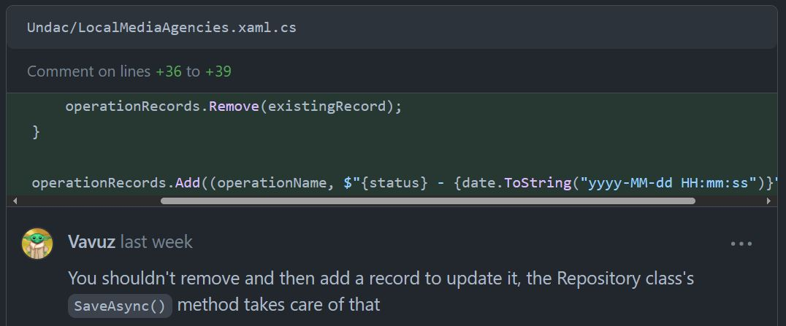
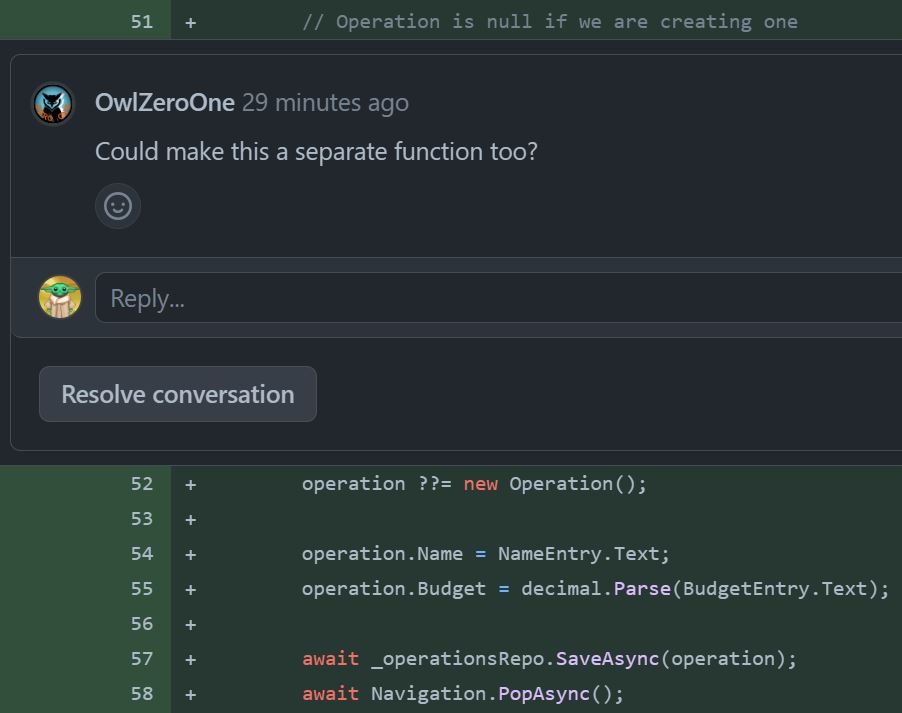

# Implementation

Week 12 aims to integrate everything covered in the module.

Your portfolio entry should demonstrate your abilities, highlight improvements that you
have made during the course of the module and show your capacity to learn from experience
through clear analytical reflection. The structure of this entry is similar to those from 
weeks 8-10:

* A descriptive summary of the issue that you worked on.
* Snippets from your code with commentary showing how you have used good software design 
  practice.
* A descriptive summary of the test code that you have written.
* A reflective summary of any changes that were requested during the code review along 
  with your fixes.
* A descriptive summary of any issues you found with the code that you were asked to review.
* A general reflective section that identifies, for example,
  * New things you have realised this week
  * Common problems that can arise in a team development situation
  * How your practice compares to other people's
  * etc.

Be sure to include links to the original items in the team's GitHub repository.

As with the earlier entries related to the team project, the reflective sections should
consider your own practice and team processes. In addition, this is a good point to
include your thoughts on the general challenges related to working in a software
development team and the most effective methods to streamline operations and to safeguard
the quality of the end product.


It could be that I got better at coding, but I also presume that my teammates, but me as well, are getting tired of reviewing code that is very often similar to other code that we already reviewed. It is in fact becoming hard to spot new interesting errors and it is hard to receive some comments that we can further comment on.

It would be a smart thing to do to include in this portfolio a picture showing the actual sqlite database with tables being created


<figure>
  
  <figcaption align="center" style="font-size:11px;"><b>Fig.6 - My comment on doxygen</b></figcaption>
</figure>
<figure>
  
  <figcaption align="center" style="font-size:11px;"><b>Fig.6 - My comment on doxygen</b></figcaption>
</figure>
<figure>
  
  <figcaption align="center" style="font-size:11px;"><b>Fig.6 - My comment on doxygen</b></figcaption>
</figure>

```cs
public async void OnStatusChanged(object sender, EventArgs e)
{
    if (string.IsNullOrWhiteSpace(NameEntry.Text) ||
        string.IsNullOrWhiteSpace(BudgetEntry.Text) ||
        !decimal.TryParse(BudgetEntry.Text, out _) ||
        decimal.Parse(BudgetEntry.Text) < 0)
    {
        await DisplayAlert("Error", "One of the fields is not valid", "OK");
        return;
    }

    UpdateOperation();
}

public async void UpdateOperation()
{
    // Operation is null if we are creating one
    operation ??= new Operation();

    operation.Name = NameEntry.Text;
    operation.Budget = decimal.Parse(BudgetEntry.Text);

    await _operationsRepo.SaveAsync(operation);
    await Navigation.PopAsync();
}
```

<figure>
  
  <figcaption align="center" style="font-size:11px;"><b>Fig.6 - My comment on doxygen</b></figcaption>
</figure>