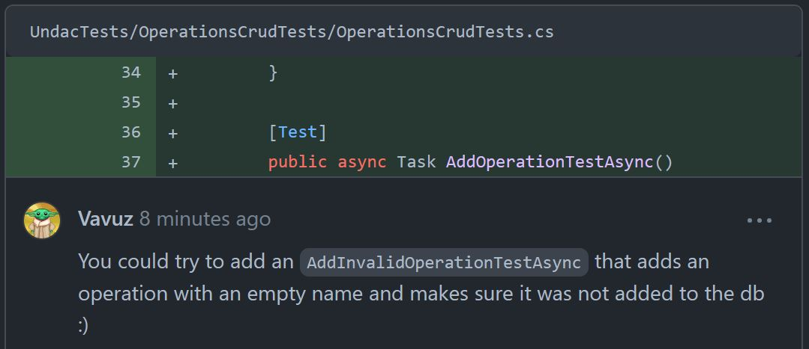

# Project work 5

This final portfolio aims to describe the work done during week twelve, which, as the previous four weeks, consisted in bringing together all the principles and techniques of software engineering that we had learnt, and use them to complete an issue, test it, solve the comments it received, and finally review someone else's code. But also draw some conclusions on the whole twelve weeks experience.

---
<br>

## My task

After thinking about what would be best to do for the last portfolio I decided that picking the usual issue and implement it as usual would be fine, but it would have been better if I grabbed a ticket that I already did and improved it: this ticket is last week's.
We have already seen the aim of last week's issue (https://github.com/xinjoonha/SET09102_PURPLE/issues/102), but what did I decide to improve?
<br><br>

## The code and tests

In the past few weeks we have been talking about three steps to implement CRUD functionalities but this time I will go over two things that I improved from my ticket. The first one was <span style="color:orange">merging master</span> into my branch to implement the changes to the injection of the repositories that my teammate made. This mostly changed the constructors of the pages as you can see below:

```cs
// Page before
public AllOperationsPage()
{
    InitializeComponent();
    operationsRepo = new OperationRepository(App.Database.Database);
    operationResourceRequestRepositoryRepo = new OperationResourceRequestRepository(App.Database.Database);
}

// Page after
public AllOperationsPage(IOperationRepository orgRepo, IOperationResourceRequestRepository orgResRepo )
{
    operationsRepo = orgRepo;
    operationResourceRequestRepositoryRepo = orgResRepo;
    InitializeComponent();
}

// MauiProgram file
builder.Services.AddSingleton<IOrganisationRepository, OrganisationRepository>();
builder.Services.AddSingleton<IExpertRepository, ExpertRepository>();
builder.Services.AddSingleton<IRoomTypesRepository, RoomTypesRepository>();
builder.Services.AddSingleton<ITeamMemberRepository, TeamMemberRepository>();
builder.Services.AddSingleton<IOperationRepository, OperationRepository>();
builder.Services.AddSingleton<IOperationResourceRequestRepository, OperationResourceRequestRepository>();
```

The second change, small but quite important, was a <span style="color:orange">test fix</span>, in fact a few of my new Operation tests were not working, specifically the ones that were testing whether or not saving was working when passing an invalid object. Also the database file was not deleted once the tests were done. The first two tests were removed as I noticed that I was calling the wrong method, and the file not being deleted was fixed by modifying the `TearDownA()` method:

```cs
using Undac.Data;
using Undac.Data.Repositories;
using Undac.Models;

[TestFixture]
public class OperationCrudTests
{
    private UndacDatabase _database;
    private string _testDatabasePath;
    private IOperationRepository _operationRepository;
    private IOperationResourceRequestRepository _operationResourceRequestRepository;

    [OneTimeSetUp]
    public async Task OneTimeSetUpAsync()
    {
        // Create a test database file path within your unit test project
        _testDatabasePath = Path.Combine(TestContext.CurrentContext.TestDirectory, "TestFiles", "TestDB.db3");

        // Create an instance of UndacDatabase using the test database path
        _database = new UndacDatabase(_testDatabasePath);
        await _database.Init();
        _operationRepository = new OperationRepository(_database);
        _operationResourceRequestRepository = new OperationResourceRequestRepository(_database);
    }

    [OneTimeTearDown]
    public void TearDownA()
    {
        _database.Connection.CloseAsync();
        System.Threading.Thread.Sleep(1000);
        File.Delete(_testDatabasePath);
    }

    [Test]
    public async Task AddOperationTestAsync()
    {
        var testOperation = new Operation { ... };
        await _operationRepository.SaveAsync(testOperation);

        var readOperation = await _operationRepository.GetAsync(testOperation.Id);

        Assert.That(readOperation, Is.Not.Null, "Test Operation was not saved");
        Assert.That(readOperation.Name, Is.EqualTo(testOperation.Name), "Test Operation name not matching");
    }

    [Test]
    public async Task AddOperationResourceRequestTestAsync()
    {
        var testOperationResourceRequest = new OperationResourceRequest { ... };

        await _operationResourceRequestRepository.SaveAsync(testOperationResourceRequest);

        var readOperationResourceRequest = await _operationResourceRequestRepository.GetAsync(testOperationResourceRequest.Id);

        Assert.That(readOperationResourceRequest, Is.Not.Null, "Test Operation was not saved");
        Assert.That(readOperationResourceRequest.Name, Is.EqualTo(testOperationResourceRequest.Name), "Test Operation name not matching");
    }

    [Test]
    public async Task DeleteOperationTestAsync()
    {
        var testOperation = new Operation
        {
            Name = "Operation",
            Budget = 80000,
            Requests = new List<OperationResourceRequest> { ... }
        };
        await _operationRepository.SaveAsync(testOperation);

        await _operationRepository.DeleteAsync(await _operationRepository.GetAsync(testOperation.Id));
        var readOperationTwo = await _operationRepository.GetAsync(testOperation.Id);

        Assert.That(readOperationTwo, Is.Null, "Test Operation was not deleted");
    }

    [Test]
    public async Task GetOperationTestAsync()
    {
        var testOperation = new Operation { ... };
        var testOperationTwo = new Operation { ... };

        await _operationRepository.SaveAsync(testOperation);
        await _operationRepository.SaveAsync(testOperationTwo);

        var operationList = await _operationRepository.GetAllAsync();
        var operationOne = operationList.FirstOrDefault(op => op.Name == testOperation.Name);
        var operationTwo = operationList.FirstOrDefault(op => op.Name == testOperationTwo.Name);

        Assert.That(operationOne.Name, Is.EqualTo(testOperation.Name), "The first test operation was not retrieved");
        Assert.That(operationTwo.Name, Is.EqualTo(testOperationTwo.Name), "The second test operation was retrieved");
    }
}

```

## The review

The final comments I will talk about were left on last weeks pull request (https://github.com/xinjoonha/SET09102_PURPLE/pull/105), the first one is shown in figure 1:

<figure>
  
  <figcaption align="center" style="font-size:11px;"><b>Fig.1 - Comment on my PR</b></figcaption>
</figure>

My teammate left a comment saying it would be nice if I moved a block of code into a separate method. I thought it was a really good idea and after doing it it is possible to see that the code looks much better:

```cs
public async void OnStatusChanged(object sender, EventArgs e)
{
    if (string.IsNullOrWhiteSpace(NameEntry.Text) ||
        string.IsNullOrWhiteSpace(BudgetEntry.Text) ||
        !decimal.TryParse(BudgetEntry.Text, out _) ||
        decimal.Parse(BudgetEntry.Text) < 0)
    {
        await DisplayAlert("Error", "One of the fields is not valid", "OK");
        return;
    }

    UpdateOperation();
}

public async void UpdateOperation()
{
    // Operation is null if we are creating one
    operation ??= new Operation();

    operation.Name = NameEntry.Text;
    operation.Budget = decimal.Parse(BudgetEntry.Text);

    await _operationsRepo.SaveAsync(operation);
    await Navigation.PopAsync();
}
```

<figure>
  
  <figcaption align="center" style="font-size:11px;"><b>Fig.2 - Comment on my PR</b></figcaption>
</figure>

Some of the comments that I prefer are the ones regarding the UI as I really enjoy making the UI of an application look better. My friend mentioned that the budget was not very visible and I agree, but after I run my application I noticed that the number was white on my end, therefore I understood that probably he had a different color configuration on Visual Studio so I added a `TextColor` field to make it universal:

```xml
<StackLayout Orientation="Horizontal" Spacing="5">
    <Label Text="Budget: " FontSize="14" TextColor="{DynamicResource SecondaryTextColor}" />
    <Label Text="{Binding Budget}" TextColor="{DynamicResource TitleTextColor}" FontSize="14" />
</StackLayout>
```

---
<br><br>

## My code review

We can see three different comments left by me on my teammates pull requests.

<figure>
  
  <figcaption align="center" style="font-size:11px;"><b>Fig.3 - My comment on filtering</b></figcaption>
</figure>

This comment shows apreciation for my teammate because even if the ticket did not ask for filtering of the data he still added it. At the same time I know that a software developer should stick to requirements, so I was doing this code review aware.

<figure>
  
  <figcaption align="center" style="font-size:11px;"><b>Fig.4 - My comment on tests</b></figcaption>
</figure>

I suggested my friend to add some extra tests to his test class, in fact it looked a bit empty and I suggested to test for invalid objects insertion. Even though after I realised that we cannot do it as the actual check is not done in the `SaveAsync()` method but in the method attached to the save button, I simply allowed those tests to be as they were.

<figure>
  
  <figcaption align="center" style="font-size:11px;"><b>Fig.5 - My comment on wrong implementation</b></figcaption>
</figure>

Here we can see a bigger mistake, my teammate wrote some code to update an entry, but instead of creating an update method he deleted the object and then re-inserted it with the new values. This should not be the way to save data to a data structure, which also should be a `Repository`, and not a list like in this case. An update method should do the job.

---
<br><br>

## Reflection

- Unfortunately me and probably my teammates too, are starting to find **repetitive** the task of reviewing code that is very often similar to other code that we already reviewed. It is in fact becoming hard to spot new interesting errors and it is hard to receive some comments that we can further comment on. That is why I feel like this is just the right time to conclude a series of porfolios with some more technical reflective evaluation!
- There could not be a better evaluation method for my portfolio's quality than the professor himself. This week I managed to have a short **discussion with my professor** about my portfolio, during which he let me know that I could do better, for example that I have to take care about the size of the images that I put in the portfolio, or that I could add some more links or that I should focus more on the practical work I do (that was for week 3 portfolio). The latter is not as valid anymore as the portfolios are more about the reflection on the work that we did, but at least I now know how to write a better portfolio for future reference.
- After thinking about all the things I could mentioned I also thought that it would be a great idea to include in this portfolio something that I have not included in the others, and it's a picture of the database itself, as a proof of the fact that our team's application is actually working on an **SQLite database**. I usually code on the Visual Studio IDE, but in this case I decided it was a good idea to move to a code editor: the table was visualised using the Visual Studio Code extension SQLite Viewer.

<figure>
  
  <figcaption align="center" style="font-size:11px;"><b>Fig.6 - SQLite database</b></figcaption>

- A good improvement with the team's workflow was that we started doing a sort of **standup meeting** every Monday for the past two Mondays. This was a great way to get more into the software engineering methods, therefore make the whole process easier by knowing what our teammates were doing and by getting some tips from them.
- The **workflow** file itself, in the group repository, did not change. We honestly thought it was basically ideal and did not need any major change, in fact it always has consisted and still consists in picking up a task, creating a branch, making changes, creating a pull request, receiving and addressing comments, merging the pull request and deleting the branch. In week 9 I did mention the possibility of changing the workflow, we could have had a more thorough discussion about it, but since it was not urgent and since we do realise that in a real work environment this should have been done, I am happy with how things went and with the knowledge I gained.
- In addition to my work I think it is good and **valuable to comment on my teammates work** from time to time, in fact one of my teammates introduced GitHub actions workflow to our project to automate the test run, this was honestly an amazing job and a very brave move as he never done anything like that before but he still decided to try and succedeed.
- A comment on the ISP **interface segregation principle**: it is possible to see that we created a lot of interface for our `Repository` classes, let's think for a second that the codebase was way more complex that that and had thousands of properties and methods, in that case we could then say that we really applied ISP, in this case I don't think we can say it yet. We could say that we violated YAGNI, but abstracting all the interfaces in that way was also needed to make the codebase tidier and for the database to work fine with every single object to store. This is an interesting question which I could ask my professor.
- I think that also a short further comment on the **tests** can be made, they have followed the famous four stages of tests which are setup, definition of expected result, method call and teardown, and the layout was also adopted by every team mate. They could have definitely been expanded to test for more use cases, but time was not on our side. Regarding the thing I did to improve my tests, mentioned in the "The code and tests" section above, this actually turned out to be a common issue among the teammembers so a teammate solved it and pushed the code to main.
- Concluding we can finally outline a **persona improvement** as this has been a really tough module for me, despite the difficulty in gathering all the data to write about and connecting the lecture notes information with the portfolio's material I consider myself to have gained a lot of useful knowledge of software engineering and I am honestly proud of each single portfolio I made but most of all of the few teammates that always helped me from the beginning to the end. 


