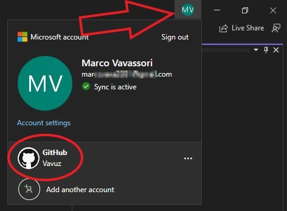

# Setup

This document aims to describe the work done during the practical session of week two, which consisted in setting up a development environment on our laptops.

## Environment configuration

The goals for week 2's practical were the following four:
1. Creating a shared GitHub repository for the team
2. Setting up a project in GitHub with an integrated task board
3. Configuring a personal copy of Visual Studio appropriately
4. Cloning the shared repository  

**1. Creating a shared GitHub repository**

<figure>
  
  <figcaption align="center"><b>Fig.1 - Creating a Repository</b></figcaption>
</figure>

Creating a repository is simple: after going into "Your repositories" I clicked on "New" and filled in all the neccessary fields. But what is a **shared** GitHub repository? Nothing complicated, just a normal repository, like the one I created, to which collaborators are added.

<figure>
  
  <figcaption align="center"><b>Fig.2 - Adding collaborators</b></figcaption>
</figure>

How do you add collaborators? To do it I went into the repository's settings, clicked on "Collaborators" and then on "Add people". They can be added via username, email and even full name!  

**2. Setting up a project in GitHub**

Initially we were looking for an external service that could have helped us with setting up a project with a task board. One of the group members was familiar with Zenhub, but we quickly discovered it was not free; then we tried to use Zube, which we also used for the Software Engineering Methods module in year 2, but unfortunately it only supported groups of four people at most. That's when we thought about using GitHub projects, simple and easy.

<figure>
  
  <figcaption align="center"><b>Fig.3 - Creating a project</b></figcaption>
</figure>

After going into the repository we clicked on "Projects", then on the dropdown arrow and "New Project", we then hit "Create" and the board was ready to be used.

<figure>
  
  <figcaption align="center"><b>Fig.4 - Project Board</b></figcaption>
</figure>

The layout can be changed from the dropdown arrow next to the view's name (figure 4 at the top), I prefer to use "Board" layout, and the items can be added by clicking on "+ Add item" (figure 4 at the bottom).

<figure>
  
  <figcaption align="center"><b>Fig.5 - My team's project board</b></figcaption>
</figure>

Figure 5 shows my team's project board with two small tasks done!  

**3. Configuring Visual Studio**

<figure>
  
  <figcaption align="center"><b>Fig.6 - Download Visual Studio</b></figcaption>
</figure>

As you can see in the picture above, Visual Studio Community version, which is free, is available for download on the Microsoft website at the following link: https://visualstudio.microsoft.com/downloads/.

<figure>
  
  <figcaption align="center"><b>Fig.7 - .NET MAUI Framework</b></figcaption>
</figure>

While installing Visual Studio 2022 we are prompted with a window (see above) in which we can select all the extra packages that we would like to install and add to our configuration of Visual Studio. Since we are going to develop an application in .NET MAUI it is important that we select the workload circled in red, all the others are not mandatory for us. 
After the download Visual Studio was ready to be launched. Before doing anything else we all made sure to log into GitHub from Visual Studio to avoid issues with the repository we were about to clone.

<figure>
  
  <figcaption align = "center"><b>Fig.8 - Logging into GitHub</b></figcaption>
</figure>

To do so you can click on your profile icon on the top right and add your GitHub account, as you can see in figure 8, otherwise you can simply log in when Visual Studio will ask you to during a Git operation! 
Finally we created a new empty .NET MAUI project and pushed it to the GitHub repository so it could be cloned by the rest of the team.  

**4. Cloning the shared repository**

<figure>
  
  <figcaption align="center"><b>Fig.9 - Cloning a repository</b></figcaption>
</figure>

Cloning a repository is a very simple process. According to GitHub there are three ways to do it:
* HTTPS: after selecting HTTPS a command is provided, that can be pasted after the `"git clone"` command either in a cmd/shell or in a Git bash.
* SSH: after selecting SSH a command is provided, that can be pasted after the `"git clone"` command either in a cmd/shell or in a Git bash. This will work only if you have SSH keys configured.
* GitHub CLI: after selecting GitHub CLI a command is provided, that can be pasted into GitHub CLI which is a tool made specifically for GitHub.

Personally I prefer to use the first one. First I made a folder in which I could copy the repository, then I started a shell from it.

<figure>
  
  <figcaption align="center"><b>Fig.10 - Opening shell from a folder</b></figcaption>
</figure>

To do so you can right click an empty space while holding the Shift key and then click on "Open PowerShell window here". After that I wrote the command `"git clone <repository link>"` using the repository link that I copied before, I was ready to work with GitHub and Visual Studio!

<figure>
  >
  <figcaption align="center"><b>Fig.11 - Project pulled and GitHub working</b></figcaption>
</figure>

By looking at the figure above you can see that I have all the files of the repository on my personal machine (figure 11 at the top) and that I am connected to the right repository and branch (figure 11 at the bottom).   

## Reflection

This was a soft but impactful start to this trimester's group project. The fact that the first "task" was not too challenging gave the team and I the chance to slowly get back on track after the summer break, but also the chance to start getting to know each other, our strength and weaknesses and how to effectively work together.

### 1. Creating a shared GitHub repository for the team
Initially it sounded like nobody had ever used GitHub before but I am guessing it was just shyness, in fact no long after we gathered, one of us had already created a shared repository. It was an easy task, even for someone who has never used GitHub before, as it is very intuitive. No one struggled and we quickly proceeded.

### 2. Setting up a project in GitHub with an integrated task board
That was the most collaborative part of the lesson, we discussed the options that we had, how familiar we were with them and then we all agreed on one solution for the creation of our project, which was GitHub itself. The team is honestly enjoyable to work with and full of bright people.

### 3. Configuring a personal copy of Visual Studio appropriately
I personally had no issues with setting up a personal copy of Visual Studio as I have been using it for a few years now. Unfortunately I could not keep my Visual Studio 2019 as .NET MAUI is only avaiable on the 2022 version, so I simply re-installed it. The rest of the team looked fine too, but in my opinion, knowing how many people have never used C# before, it is very likely that someone did not know exactly what to select during the installation but did not ask because it might have felt embarassing. I will try to make sure that everybody is keeping up with the pace during the next practical session.

<figure>
  
  <figcaption align="center"><b>Fig.12 - Modifying VS Workloads</b></figcaption>
</figure>

**N.B.** Despite the screenshot from figure 7 only showing one selected workload (".NET Multi-platform App UI develpment"), I also selected a few others in my own configuration. In fact that one is specifically made for desktop and mobile applications development for Android, iOS, Windows, and Mac. But if we want to develop anything else, like a Web Application or a Game, we would have to include other workloads like "ASP.NET and web development" or "Game development with C++". This is not a problem as it can always be added later on by opening the VS installer and clicking on "Modify", then the window in figure 12 will display.

### 4. Cloning the shared repository
Despite it sounding like the only thing to do was to clone the repository, there was some extra work to it, which is to connect the local repository to the GitHub one, to be able to push changes to it. This can actually be very tricky for someone who is new to GitHub. Again, I was perfectly fine with it but that makes me realise, again, that next time I should try to make sure everybody else is comfortable too since we are working as a team.  

---

Fortunately I already had some experience with everything we did during this practical, so I have to admit that the most difficult part about it was gathering everybody's contact details to create a groupchat where we could communicate outside of school hours. Overall I can say that my development environment is definitely working and was correctly set up, meaning I can start working on the rest of the tasks with my team!