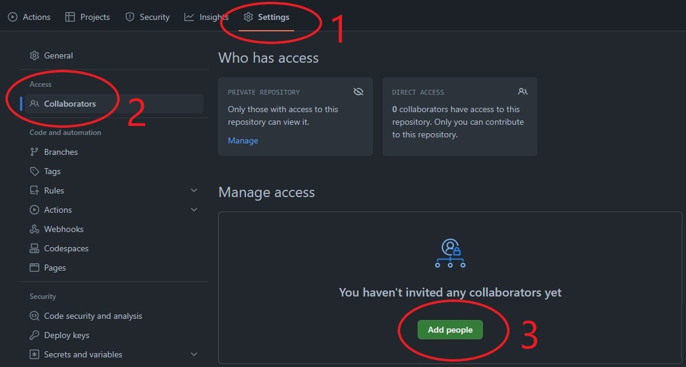
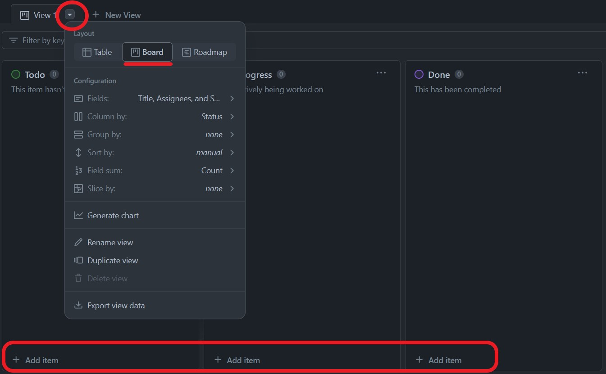
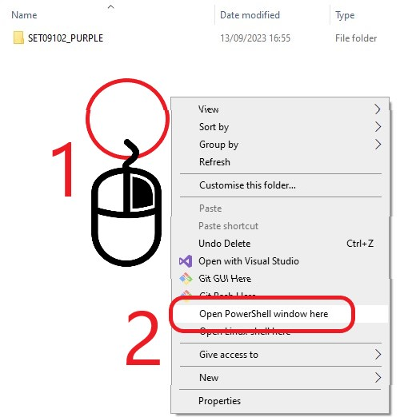

# Setup

This document aims to describe the work done during the practical session of week two, which consisted in setting up a development environment on our laptops.

## Environment configuration

The goals for week 2's practical were the following four:
1. Creating a shared GitHub repository for the team
2. Setting up a project in GitHub with an integrated task board
3. Configuring a personal copy of Visual Studio appropriately
4. Cloning the shared repository  

**1. Creating a shared GitHub repository**

<figure>
  
  <figcaption align="center"><b>Fig.1 - Creating a Repository</b></figcaption>
</figure>

Creating a repository is simple: after going into "Your repositories" I clicked on "New" and filled in all the neccessary fields. But what is a **shared** GitHub repository? Nothing complicated, just a normal repository, like the one I created, to which collaborators are added.

<figure>
  
  <figcaption align="center"><b>Fig.2 - Adding collaborators</b></figcaption>
</figure>

How do you add collaborators? To do it I went into the repository's settings, clicked on "Collaborators" and then on "Add people". They can be added via username, email and even full name!  

**2. Setting up a project in GitHub**

Initially we were looking for an external service that could have helped us with setting up a project with a task board. One of the group members was familiar with Zenhub, but we quickly discovered it was not free; then we tried to use Zube, which we also used for the Software Engineering Methods module in year 2, but unfortunately it only supported groups of four people at most. That's when we thought about using GitHub projects, simple and easy.

<figure>
  
  <figcaption align="center"><b>Fig.3 - Creating a project</b></figcaption>
</figure>

After going into the repository we clicked on "Projects", then on the dropdown arrow and "New Project", we then hit "Create" and the board was ready to be used.

<figure>
  
  <figcaption align="center"><b>Fig.4 - Project Board</b></figcaption>
</figure>

The layout can be changed from the dropdown arrow next to the view's name, I prefer to use "Board" layout, and the items can be added by clicking on "+ Add item".

<figure>
  
  <figcaption align="center"><b>Fig.5 - My team's project board</b></figcaption>
</figure>

Figure 5 shows my team's project board with two small tasks done!  

**3. Configuring Visual Studio**

<figure>
  
  <figcaption align="center"><b>Fig.6 - Download Visual Studio</b></figcaption>
</figure>

As you can see in the picture above, Visual Studio Community version, which is free, is available for download on the Microsoft website at the following link: https://visualstudio.microsoft.com/downloads/.

<figure>
  
  <figcaption align="center"><b>Fig.7 - .NET MAUI Framework</b></figcaption>
</figure>

While installing Visual Studio 2022 we are prompted with a window (see above) in which we can select all the extra packages that we would like to install and add to our configuration of Visual Studio. Since we are going to develop an application in .NET MAUI it is important that we select the workload circled in red, all the others are not mandatory for us. 
After the download Visual Studio was ready to be launched. Before doing anything else we all made sure to log into GitHub from Visual Studio to avoid issues with the repository we were about to clone.

<figure>
  
  <figcaption align = "center"><b>Fig.8 - Logging into GitHub</b></figcaption>
</figure>

To do so you can click on your profile icon on the top right and add your GitHub account, as you can see in figure 8, otherwise you can simply log in when Visual Studio will ask you to during a Git operation! 
Finally we created a new empty .NET MAUI project and pushed it to the GitHub repository so it could be cloned by the rest of the team.  

**4. Cloning the shared repository**

<figure>
  
  <figcaption align="center"><b>Fig.9 - Cloning a repository</b></figcaption>
</figure>

Cloning a repository is a very simple process. According to GitHub there are three ways to do it:
* HTTPS: after selecting HTTPS a command is provided, that can be pasted after the `"git clone"` command either in a cmd/shell or in a Git bash.
* SSH: after selecting SSH a command is provided, that can be pasted after the `"git clone"` command either in a cmd/shell or in a Git bash. This will work only if you have SSH keys configured.
* GitHub CLI: after selecting GitHub CLI a command is provided, that can be pasted into GitHub CLI which is a tool made specifically for GitHub.

Personally I prefer to use the first one. First I made a folder in which I could copy the repository, then I started a shell from it.

<figure>
  
  <figcaption align="center"><b>Fig.10 - Opening shell from a folder</b></figcaption>
</figure>

To do so you can right click an empty space while holding the Shift key and then click on "Open PowerShell window here". After that I wrote the command `"git clone <repository link>"` using the repository link that I copied before, I was ready to work with GitHub and Visual Studio!

<figure>
  
  <figcaption align="center"><b>Fig.11 - Project pulled and GitHub working</b></figcaption>
</figure>

By looking at the figure above you can see that I have all the files of the repository on my personal machine and that I am connected to the right repository and branch.   

**DO**

* Place your image files in the `images` folder
* Choose your screenshots carefully so that they communicate the appropriate information.
  Many screenshots with no clear purpose or with trivial differences are of little value.
* Provide <ins>descriptive</ins> commentary to explain why the screenshot is included. 
  what it shows and point out any particularly significant details.
* Modify your screenshots - for example, by adding arrows, outlines or other highlighting 
  techniques - to enhance their communication value.
* Remove unnecessary material from your screenshots such as toolbars, other windows and 
  computer desktop to eliminate distractions.
* Ensure that any important content is clearly legible. Pay particular attention to text
  size and image resolution.
* Use [numbered captions](https://towardsdev.com/3-ways-to-add-a-caption-to-an-image-using-markdown-f2ca30562be6) 
  as labels for images. Also, use the caption numbers to refer to images in your text.

## Reflection

For this section, decide what points are worth making and structure your content 
appropriately.

**DO**

* Use sub-headings to differentiate between sections
* Provide <ins>reflective</ins> commentary that discusses, for example, limitations of
  your current configuration, how your configuration is appropriate for the current 
  project, alternative configuration that might be appropriate in ther circumstances, 
  etc.
* Mention any difficulties you had setting up your working environment and how you 
  resolved them

**DON'T**

* Repeat the descriptive commentary from point 1
* Give a blow-by-blow account of everything you did. Instead, you should highlight 
  the important points.

The environment is correctly set up and we can start working on the following tasks!