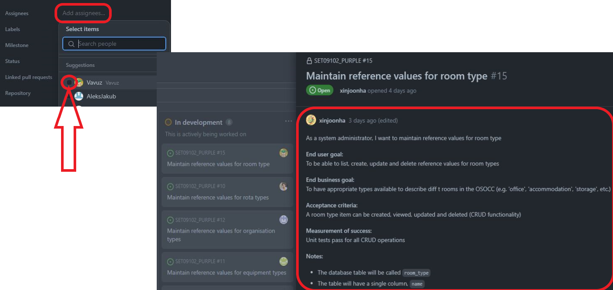
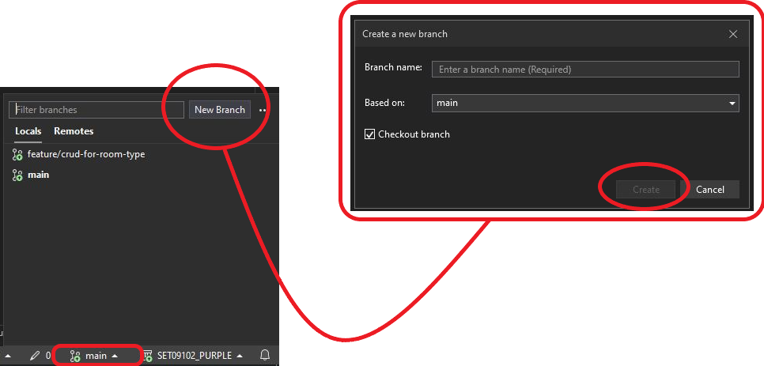
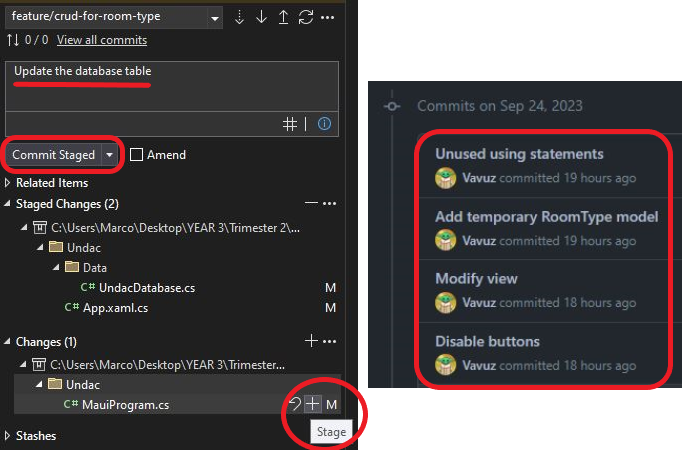
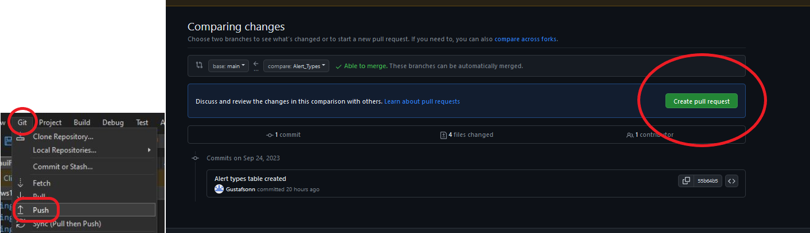
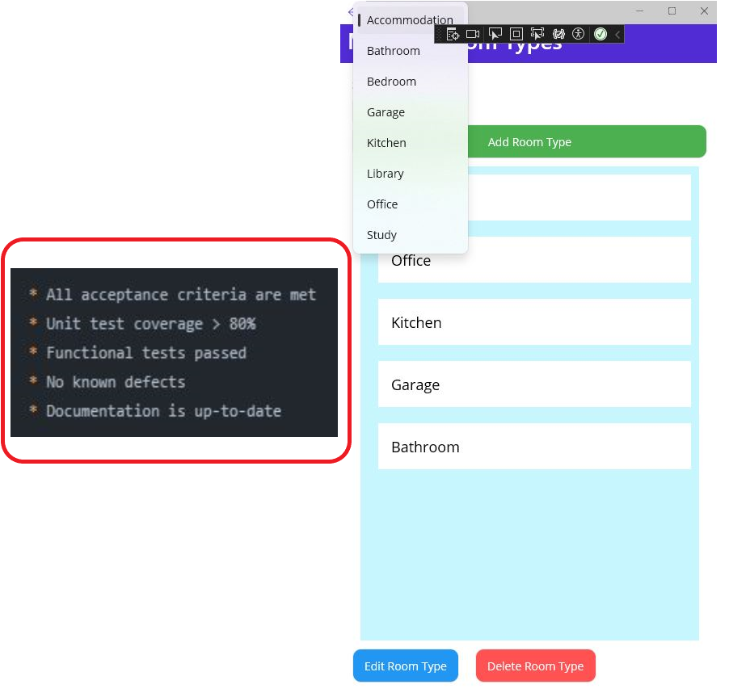
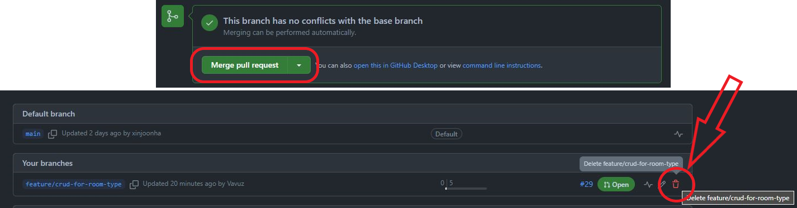
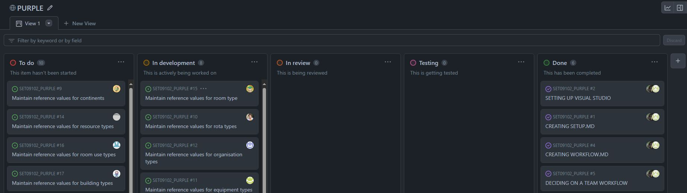

# Workflow

This document aims to describe the work done during the practical session of week three, which consisted in choosing a team workflow and creating a basic .NET MAUI application.

## Task workflow

The first thing we decided to do was to choose a workflow for the team, we chose GitHub workflow. As our documentation shows, GitHub workflow consists in following a few steps:

<figure>
  
  <figcaption align="center" style="font-size:11px;"><b>Fig.1 - Assigning and editing a task</b></figcaption>
</figure>

I started by picking up a task from the board, which can be assigned to myself simply by clicking on it, then "Add assigneees..." and then my name. Afterwards I updated its description so it was clear what the requirements and the acceptance criteria were, in my case to create a table called `room_type` and use CRUD functionalities on it through a MAUI app.

<figure>
  
  <figcaption align="center" style="font-size:11px;"><b>Fig.2 - Creating a branch</b></figcaption>
</figure>

I created a branch to start working on my task, this was done in Visual Studio. I clicked on the main branch, then "New Branch", I typed the name, made sure "Checkout" was checked and then hit "Create". I was now positioned on my new branch and I could start writing code.

<figure>
  
  <figcaption align="center" style="font-size:11px;"><b>Fig.3 - Committing changes</b></figcaption>
</figure>

To save my code each time a new functionality was added I used the Git commits, they are like checkpoints that allow you to save the state of your code. To do a commit I staged the changes I wanted to save by clicking the "+" sign next to them, gave them a meaningful name (above on the right is a screenshot of some commit names I used) and hit "Commit Staged".

<figure>
  
  <figcaption align="center" style="font-size:11px;"><b>Fig.4 - Creating a Pull Request</b></figcaption>
</figure>

After that I created a pull request, it is a request to pull your code into the main branch, that way everyone can look at it, leave comments and reject/approve it. To do it I pushed my code from Visual Studio by clicking "Git" and then "Push". Afterwards I moved onto GitHub where I simply selected my branch, clicked on "Create pull request" and filled in some basic information. This was my first Pull request for this project: https://github.com/xinjoonha/SET09102_PURPLE/pull/29.

<figure>
  
  <figcaption align="center" style="font-size:11px;"><b>Fig.5 - Definition of Done</b></figcaption>
</figure>

Before the next steps it is important to address all comments and then compare the work done to the DoD: definition of done. The acceptance criteria (shown in figure 1) were met (I included a picture of the app just to show the CRUD functionality). Unit tests did not pass as I was not able to finish writing them due to some lack of knowledge in the database mocking process, but some further manual testing was done and passed. 
There is only one little defect which is that you can edit a room type to any text you want and finally we do not have a documentation related to these issues, so it is technically up-to-date. 
If I was in a professional environment I would absolutely not consider this task as done, and even in this scenario, I would still consider it as not done, just because of the missing unit tests, meaning it is not good enough to be pulled into the main branch.

<figure>
  
  <figcaption align="center" style="font-size:11px;"><b>Fig.6 - Merging and Deleting a Pull Request</b></figcaption>
</figure>

The last things to do were to merge the pull request, by clicking on "Merge pull request", and delete the branch by going into the list of branches and clicking on the little bin icon next to my branch's name (I haven't done these last two steps yet).   

## Reflection

### A challenging practical
Unlike last week not everything went smoothly as during this practical session new problems started to appear. Usually a team of developer is made of 6-7 people, but our has 17 people in it and it is being particularly difficult to work in harmony. It is not about the participants, but about the difficulty of making everybody stick to certain rules, deliver work on time, agree on procedures eccetera. 
Despite my attempt to utilise a general standard for commits and branches names nobody really tried to use it but luckily enough it is not a big issue. Also considered the fact that our module gives more importance to the portfolio that we write rather than to the practical work itself. 

I have to admit that the previous week I was more content with the work done comparing to this week, but I cannot complain because we managed to import the issues, assign them to the team members, so everybody had work to do, and we agreed on a workflow to adopt.

<figure>
  
  <figcaption align="center" style="font-size:11px;"><b>Fig.7 - New board</b></figcaption>
</figure>

We adapted our GitHub project board accordingly so it fits our workflow, with a "Review" and a "Testing" column in addition to "To do", "In progress" and "Done".

### A good end result
There are definitely things that can be improved, specifically in two fields which are the engagement with the team and the quality of the work delivered. But there are also a lot of things that were achieved and well done, like the management of the tasks board and the use of GitHub workflow.

As mentioned in the Task Workflow section the definition of done was not really achieved, but that does not mean that I do not agree with it. In fact I think that having tests passing is not important, but **essential**, meaning I would be more than happy to get my pull request rejected.

Despite this last statement, this portfolio demonstrates that I have been able to select a task and describe it properly. I mamaged to work on it following GitHub workflow by creating a branch for it, saving the work done by using meaningful commits and by keeping the task's status up to date in the project board. And finally I successfully pushed my code into a Pull Request to get feedback from my team mates.