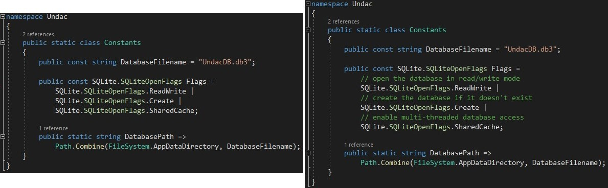
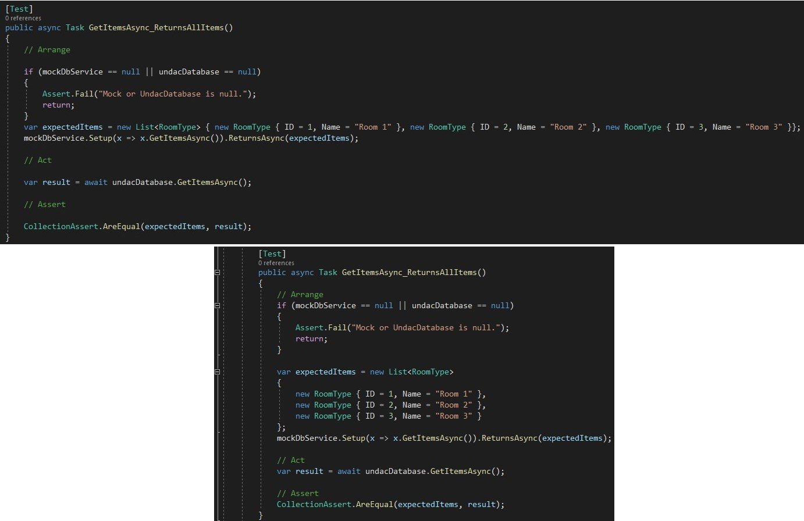
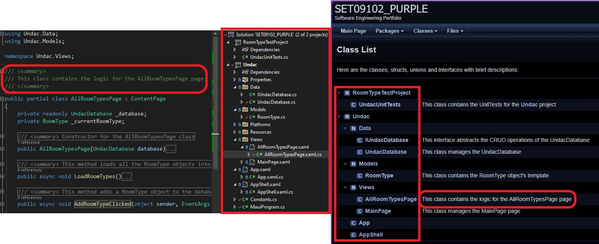
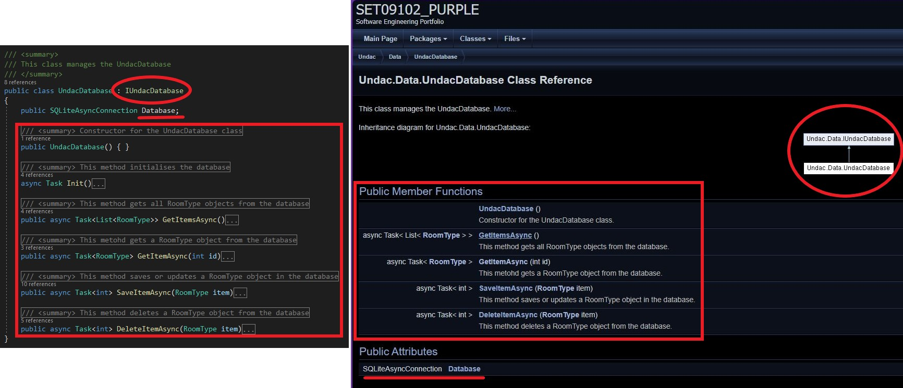
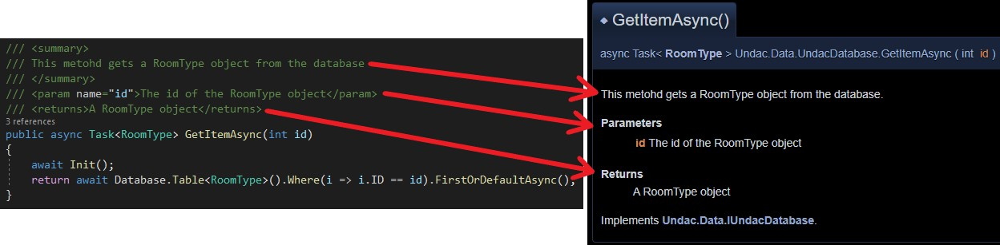
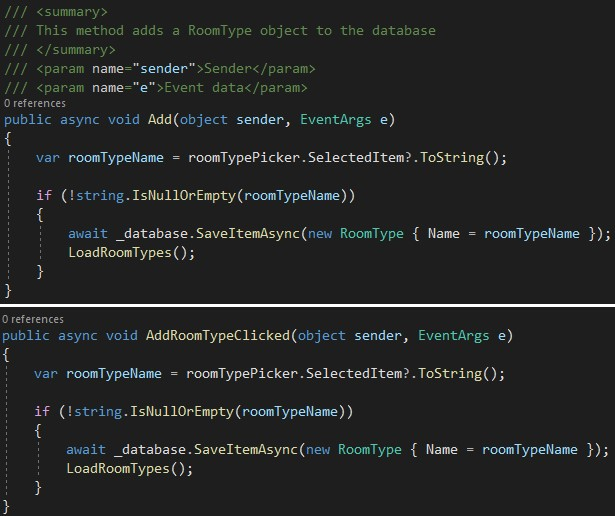
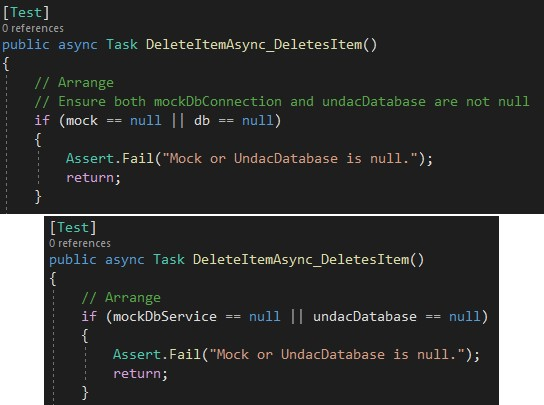
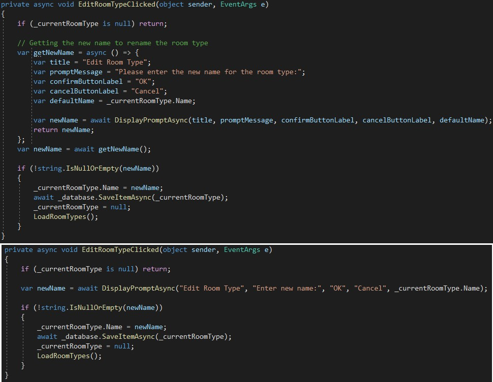

# Documentation

This document aims to describe the work done during week five, which consisted in getting into the details of clean code rules.

 ---

## Code clean rules

- **commenting**: according to the book, the comments' function is to increase code clarity and reason and they are essential to better understand the code. However, most of the time, we should also be able to write code that is self-explanatory and does not need comments, which in fact can sometimes be seen as excessive and not useful. Excess or obsolete comments are debilitated, signaling potential issues in code clarity and structure. So comments should enhance the code's understanding, and I have an example for that. 
As you can see, below is an example. In my Constants class there is a propery, called Flags, and a reader might not know what those "flags" are, despite the first two being quite self-explanatory. To solve this issue I added a comment, on each flag, explaining what it is used for, that way I enhanced my code.
<figure>
  
  <figcaption align="center" style="font-size:11px;"><b>Fig.1 - Assigning and editing a task</b></figcaption>
</figure>

- **functions**: well-organized functions are essential. They should have a clear objective and be concise. Their name should be appropriate and self-explanatory and they should have the least amount of parameters possible so they can be understood better. Last but not least they should only do one thing and have no side effects on other parts of the code. 
As you can see below
<figure>
  
  <figcaption align="center" style="font-size:11px;"><b>Fig.1 - Assigning and editing a task</b></figcaption>
</figure>

- **formatting**: once again another thing we should always look at when we are writing code, formatting. For our entire codebase to be clear and understandable, it should adhere to some standards, for example: follow the same styling format, use the same amount of space for indendation, not exceed the chosen line legth limitation, group together functions that are related, etc.
An example from my code would be the GetItemsAsync_ReturnsAllItems() method from the UndacUnitTests class: other than following the C# standard conventions like indendation and variable naming, it is also part of a class containing other functions with the aim of testing. After refinement it now also follows a specific spacing pattern between lines and abide by a line length rule as you can see below.
<figure>
  
  <figcaption align="center" style="font-size:11px;"><b>Fig.1 - Assigning and editing a task</b></figcaption>
</figure>

## Doxygen

Doxygen is a program that scans thorough your project looking for xml comments, gathers them and finally puts them together on a web page. On this webpage it is possible to look at what each class looks like, all the different methods and inheritance relations. In the first example below you can see the projects structure, and next to each class there is their corresponding xml comment:

<figure>
  
  <figcaption align="center" style="font-size:11px;"><b>Fig.1 - Assigning and editing a task</b></figcaption>
</figure>

The second example shows what happens when you click on a class name. Doxygen gathers the different XML comments in the class to put together this nice page showing the class' details like its name, its properties, any inheritance relation and the different methods it contains:

<figure>
  
  <figcaption align="center" style="font-size:11px;"><b>Fig.1 - Assigning and editing a task</b></figcaption>
</figure>

Finally each method is shown in even deeper details if you scroll down the page. You can see that the XML comment, containing a summary, a parameter and a return, is processed and an acurate description of the method is displayed  in the web page:

<figure>
  
  <figcaption align="center" style="font-size:11px;"><b>Fig.1 - Assigning and editing a task</b></figcaption>
</figure>

## Following Clean Code to eliminate comments

Adhering to the Clean Code principles also means that it will be very likely that you will have to remove some of the comments you have written since they will no longer be needed. In my case I can list three situations in which it happened:

1. (functions) the method names do not need comments because their names are completely self-explanatory. For example "Add" needed some further explanation since it could have been anything, after renaming it to AddROomTypeClicked it was clear when the event was being fired and what it was doing, therefore it did not need a comment anymore:

<figure>
  
  <figcaption align="center" style="font-size:11px;"><b>Fig.1 - Assigning and editing a task</b></figcaption>
</figure>

2. (meaningful names) From the example below it is possible to see that non-meaningful variables like "mock" or "db" will most likely need some further explanation, reason why I added the comment on top of it. This really superficial comment could be removed after renaming those two variables to something more meaningful that an other developer qho is reading can understand:

<figure>
  
  <figcaption align="center" style="font-size:11px;"><b>Fig.1 - Assigning and editing a task</b></figcaption>
</figure>

3. KISS The last one I will talk about is a very good example of applying KISS, as you can see I created an async function inside the method, that would ask the user for a new name, and afterwards I called it. This needed a comment as it might not seem clear to someone, but to solve this issue I simply tried to keep things simple and use the DisplayPromptAsync method directly instead. That way no comment was needed anymore:

<figure>
  
  <figcaption align="center" style="font-size:11px;"><b>Fig.1 - Assigning and editing a task</b></figcaption>
</figure>