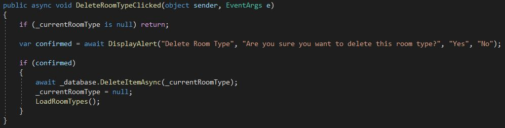
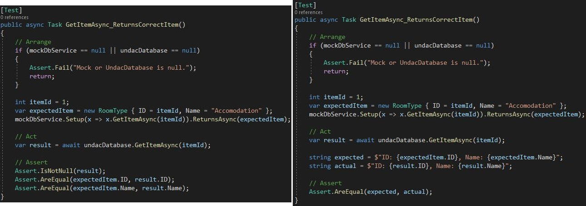
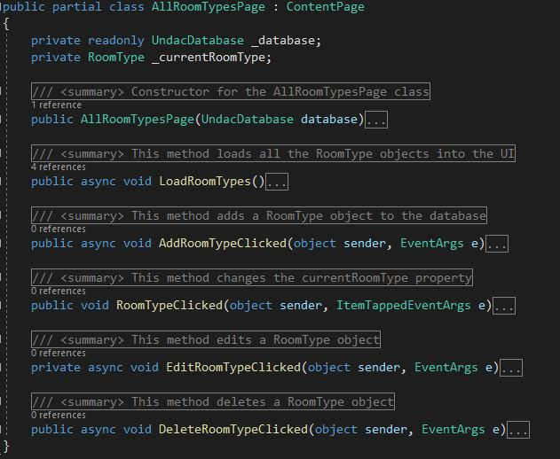
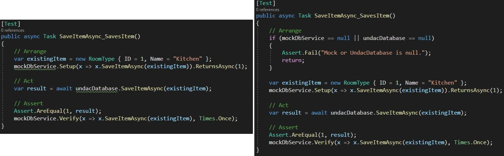

# Documentation

This document aims to describe the work done during week five, which consisted in getting a deeper understanding of the book "Clean Code" and of code documentation.<br><br>

 ---

## Applying Clean Code

We were asked to pick a few principles to which our codebase adheres. I decided to pick the following 6 as I think my code fully adopts them, so I can easily talk about how I decided to implement them:

1. **Good comments**: according to the book, the comments' function is to increase code clarity and reason, making it more understandable. However, most of the time, we should also be able to write code that is self-explanatory and does not need comments, which in fact can sometimes be seen as excessive and useless, even as a signal of potential issues. So comments should enhance the code's understanding, and I have the perfect example for that.<br>
As you can see below, in my `Constants` class there is a propery, called Flags, and a reader might not know what those "flags" are, despite the first two being quite self-explanatory. To solve this issue I added a comment, on each flag, explaining what it is used for, that way I enhanced my code:

<figure>
  
  <figcaption align="center" style="font-size:11px;"><b>Fig.1 - Writing good comments</b></figcaption>
</figure>

2. **Vertical and horizontal formatting**: once again another thing we should always look at when we are writing code, formatting. For our entire codebase to be clear and understandable, it should adhere to some standards, for example: follow the same styling format, use the same amount of space for indendation, not exceed the chosen line legth limitation, group together functions that are related, etc.
An example from my code would be the `GetItemsAsync_ReturnsAllItems()` method from the UndacUnitTests class: other than following the C# standard conventions like indendation and variable naming, it is also part of a class containing other functions with the aim of testing. After refinement it now also follows a specific spacing pattern between lines and abide by a line length rule as you can see below:

<figure>
  
  <figcaption align="center" style="font-size:11px;"><b>Fig.2 - Good formatting</b></figcaption>
</figure>

3. **Do one thing**: well-organized functions are essential. They should have a clear objective and be concise. Their name should be appropriate and self-explanatory and they should have the least amount of parameters possible so they can be understood better. Last but not least they should only do one thing and have no side effects on other parts of the code.<br>
As you can see below the `DeleteRoomTypeClicked()` method has a very descriptive name, it is concise, it only has two parameters and it is not doing anything else other than what is mentioned in its name:

<figure>
  
  <figcaption align="center" style="font-size:11px;"><b>Fig.3 - Ideal function</b></figcaption>
</figure>

4. **One assert per test**: tests are probably the most important thing to keep an eye on when programming. They help us to make sure that our code works, and if it doesn't, it helps us find where the issues are. Tests should be clear, indipendent and effective, they should obviously follow all Clean Code principles like avoiding duplication or being descriptive, and they should have one assertion.<br>
My code was initially doing more than one assertion but I found an easy way to make it a single one therefore adhere to the principle, as shown in figure 4:

<figure>
  
  <figcaption align="center" style="font-size:11px;"><b>Fig.4 - Single assertion</b></figcaption>
</figure>

5. **Classes should be small**: classes should be well structured and readable, encourage encapsulation and a right use of dependency injection; they should follow three of the five SOLID principles that mostly apply to classes which are SRP, OCP and LSP. Finally they should be be kept small and well organised. As the book says, unlike functions, classes' size is not measured by lines count but by responsibilities count.<br>
The `AllRoomTypesPage` class, which I created for taking care of the user interaction with the UI, can be easily considered a simple and small class with a perfect amount of responsabilities: 

<figure>
  
  <figcaption align="center" style="font-size:11px;"><b>Fig.5 - Ideal class</b></figcaption>
</figure>

6. **Don't pass or return null**: in Chapter 7 the book emphasizes the importance of an appropriate error management using exceptions rather than returning error codes. But it also suggests using try-catch-finally blocks at the beginning of our functions and meaningful exception messages to debug more effectively. Finally it is against passing and using null as a parameter, suggesting to use any kind of alternative, which will be more reliable.<br>
After noticing that Visual Studio was telling me about a potential issue with the fact that either `mockDbService` or `undacDatabase` could have been null, I decided to add a null check which solved the problem as shown in figure 6:

<figure>
  
  <figcaption align="center" style="font-size:11px;"><b>Fig.6 - Null avoiding</b></figcaption>
</figure><br><br>

---

## Doxygen for documenting

Doxygen is a program that scans thorough your project looking for XML comments, gathers them and finally puts them together on a web page. On this webpage it is possible to look at what each class looks like, all the different methods and inheritance relations. In the first example below you can see the project's structure, and next to each class there is their corresponding XML comment, `AllRoomTypesPage` is shown here:

```cs
/// <summary>
/// This class contains the logic for the AllRoomTypesPage page
/// </summary>
```
<figure>
  
  <figcaption align="center" style="font-size:11px;"><b>Fig.7 - Project overview</b></figcaption>
</figure>

The second example shows what happens when you click on a class name. Doxygen gathers the different XML comments in the class to put together a very informative page showing the class' details like its name, its properties, any inheritance relation and the different methods it contains. Figure 8 shows the `UndacDatabase` class:

<figure>
  
  <figcaption align="center" style="font-size:11px;"><b>Fig.8 - Class overview</b></figcaption>
</figure>

Finally each method is shown in even deeper details if you scroll down the page. You can see that the XML comment, containing a summary, a parameter and a return, is processed and an accurate description of the method, in this case `GetItemAsync()`, is displayed in the web page:

```cs
/// <summary>
/// This metohd gets a RoomType object from the database
/// </summary>
/// <param name="id">The id of the RoomType object</param>
/// <returns>A RoomType object</returns>
```
<figure>
  
  <figcaption align="center" style="font-size:11px;"><b>Fig.9 - Methods overview</b></figcaption>
</figure><br><br>

---

## Clean Code to eliminate comments

Adhering to the Clean Code principles also means that it will be very likely that you will have to remove some of the comments you have written since they will no longer be needed. In my case I can list three situations in which it happened:

1. In figure 10 it is possible to see and comprehend the importance of using **descriptive names**, in fact the `Add()` method needed some further explanation since it could have been doing anything. After renaming it to `AddRoomTypeClicked()` it was clear when the event was being fired and what it was doing, therefore it did not need a comment anymore:

<figure>
  
  <figcaption align="center" style="font-size:11px;"><b>Fig.10 - Descriptive names to avoid comments</b></figcaption>
</figure>

2. From the example below it is possible to see that non-meaningful variables like `mock` or `db` will most likely need some further explanation, reason why I added the comment on top of it. This really superficial comment could be removed after applying **meaningful names** and renaming those two variables to something more meaningful that another developer who is reading can understand:

<figure>
  
  <figcaption align="center" style="font-size:11px;"><b>Fig.11 - Meaningful names to avoid comments</b></figcaption>
</figure>

3. The last one I will talk about is a very good example of applying **KISS**: as you can see I created an async function inside the method, which would ask the user for a new name, and afterwards I called it. This needed a comment as it might not seem clear to someone, but to solve this issue I simply tried to keep things simple and use the `DisplayPromptAsync()` method directly instead. That way no comment was needed anymore:

<figure>
  
  <figcaption align="center" style="font-size:11px;"><b>Fig.12 - KISS to avoid comments</b></figcaption>
</figure>