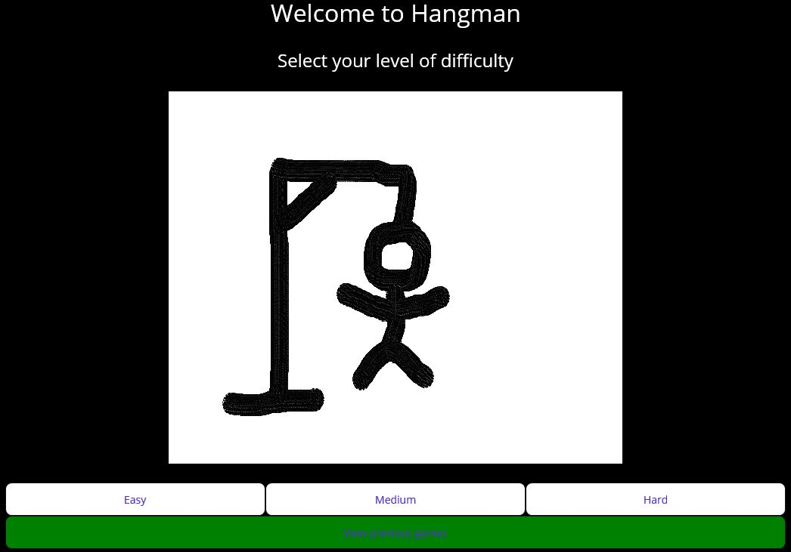
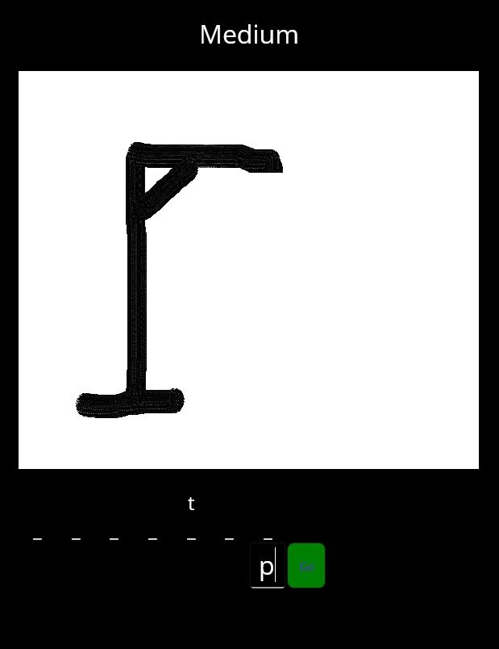

# Testing

This document aims to describe the work done during week six, which consisted in some competitive testing. This involved completing the methods of an incomplete program, testing them, and then getting them cross-tested with other group's tests and viceversa.

Select two pieces of test code that you wrote. If you were working with someone else make sure that is clear in your discussion.<br><br>


## Test 1

### The code's purpose

The first method to test was the `CreateNewChallenge()` method. This is called when the user selects one of the three difficulty levels that you can see below, as well as the method's implementation:

<figure>
  
  <figcaption align="center" style="font-size:11px;"><b>Fig.1 - Difficulty levels</b></figcaption>
</figure>

```cs
private void CreateNewChallenge()
{
    Word = SelectWord(GameType);
    ResetDisplay(Word);
}
```

The first thing this method does it to call another method called `SelectWord()`, its function is to pick a word from a list of words, that will be the one that the user is meant to guess and it is assigned to a variable called `Word`. After that, one last method is called, `ResetDisplay()`, which resets the display to the initial image plus the appropriate number of visible labels

### My test implementation

Here follows the test implementation:

```cs
public void Hello(){
  var hi = "hi";
}
```
As you can see this test does bla bla bla
It is important to test this because bla bla bla

### Limitations

My tests only have a few limitations: bla bla bla.<br><br>


## Test 2

### The code's purpose

The second method to test was the `OnAttemptSubmitted()` method. This is called after the user has clicked on the "Go" button, possibly after having written something in the text box. Below the "Go" button and the method's implementation are shown:

<figure>
  
  <figcaption align="center" style="font-size:11px;"><b>Fig.2 - Submit word</b></figcaption>
</figure>

```cs
private void OnAttemptSubmitted(object sender, EventArgs e)
{
    var answer = AnswerEntry.Text[0];
    var isCorrect = false;

    isCorrect = CheckLetterInWord(Word, answer);
    UpdateDisplay(isCorrect, Word, answer, remainingAttempts);

    remainingAttempts--;
    AnswerEntry.Text = "";
    AnswerEntry.Focus();

    if (remainingAttempts == 0)
    {
        GameOver();
    }
}
```

The first thing this method does it to assign the first character of the answer that the user has written to a variable called `answer`, then another variable called `isCorrect` is created and set to false. `isCorrect` is then updated by calling a method called `CheckLetterInWord()` which checks whether the letter appears or not in the word. `UpdateDisplay()` is called, which changes the image shown on the page and updates the visibility of the labels representing the letters in the word. Afterwards, the variable `remainingAttempts` is decreased by one, the text field is reset and focused and finally, if `remainingAttemps` has reached 0, the method `GameOver()`, which resets all game variables and displays the final result, is called.

### My test implementation

Here follows the test implementation:

```cs
public void Hello(){
  var hi = "hi";
}
```
As you can see this test does bla bla bla
It is important to test this because bla bla bla

### Limitations

My tests only have a few limitations: bla bla bla.

## Final evaluation

Did you manage to write a test which failed during the final evaluation? If so, that would
make an excellent example. You should briefly discuss why the writer of the code might 
have overlooked the particular test case that failed.