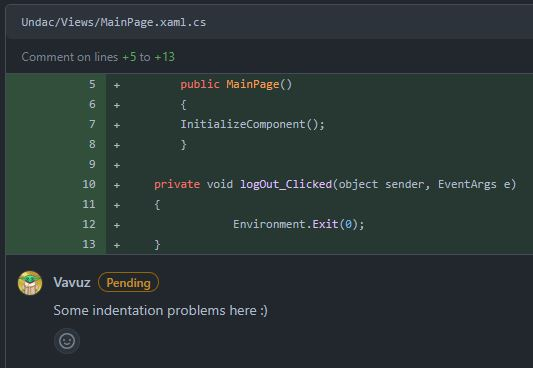

# Project work 1

This document aims to describe the work done during week eight, which consisted in bringing together all the principles and techniques of software engineering that we had learnt, and use them to complete an issue, test it, solve the comments it received, and finally review someone else's code.

---
<br>

## Our issue

Before starting to work on the task I decided to make my life easier and pick **pair programming** as the working method, that is why I will often use "we", "us" or "our". After looking through the list of issues provided by the professor we decided to pick the following:

<figure>
  
  <figcaption align="center" style="font-size:11px;"><b>Fig.1 - Our issue</b></figcaption>
</figure>

The aim of this issue (https://github.com/xinjoonha/SET09102_PURPLE/issues/48) is to create a UI that will allow an UNDAC Team Leader to look through a list of experts and recruit one or more of them. To be more specific the issue has three acceptance criteria which I will describe in just a few more details here below:
- The list of all the experts should be allowed to be filtered by **skill** of the expert and **geographical location** of the expert.
- Each expert should have an association **status**, like "invited" or "confirmed", which can be changed, and a **status change date**, which should update when we update the status.
- Another property they should have is the **working location**, like "remote" or "hybrid", which tells us their working mode.
<br><br>

## The code

The implementation of this issue consisted in 3 main steps. The <span style="color:orange">first one</span> was to **create an Expert class** that could be used around the codebase and then write the code that makes it possible to **write, read and delete items** from an SQLite database.<br>
For simplicity I will omit the Doxygen comments that we are supposed to write according to our Doxygen markdown file (https://github.com/xinjoonha/SET09102_PURPLE/blob/main/Documentation/DOXYGEN.md), however the full code can be visualised on our pull request: https://github.com/xinjoonha/SET09102_PURPLE/pull/55/files.<br>
The first snippet shows the `Expert` class, it inherits from `IIdentifiable` which simply provides it an Id, and it contains all the necessary properties: each starts with a capital letter, has a getter and a setter and an appropriate type.

```cs
[Table("expert")]
public class Expert: IIdentifiable
{
    [PrimaryKey, AutoIncrement]
    public int Id { get; set; }
    public string Name { get; set; }
    public string Skill { get; set; }
    public string GeographicalLocation { get; set; }
    public string Status { get; set; }
    public DateTime StatusChangedDate { get; set; }
    public string WorkingLocation { get; set; }
}
```

The way data is handled is now a bit different from what it used to be. Thanks to my pair programming buddy the entire codebase now adheres to the same data handling standard as he introduced the **Repository Pattern** to it. This means that now we only have one databse with a table for each datatype that we need to store, which is exactly what we were supposed to have, but was a bit difficult to achieve because of the size of our team.<br>
After having explained that, below you can see the `Repository` class which handles the CRUD operations. Whenever we add a datatype to store we create a new repository class that inherits from it, as you can see below too in the `ExpertRepository` class. This makes the codebase neater and easier to work with and maintain:

```cs
public class Repository<TEntity> : IRepository<TEntity> where TEntity : class, new()
{
    public readonly SQLiteAsyncConnection database;

    public Repository(SQLiteAsyncConnection database)
    {
        this.database = database;
    }

    public async Task<List<TEntity>> GetAllAsync() {...}

    public async Task<TEntity> GetAsync(int id) {...}

    public async Task<int> SaveAsync(TEntity item) {...}

    public async Task<int> DeleteAsync(TEntity item) {...}
}
```

Following is the `ExpertRepository` class, you can see it has an extra method, this is needed to fill the table of the database with some dummy values so we can check out the funcionalities:

```cs
public class ExpertRepository : Repository<Expert>, IExpertRepository
{
    public ExpertRepository(SQLiteAsyncConnection database) : base(database) {}

    public async Task AddDummyValues()
    {
        var dummyExperts = new List<Expert> {
            new Expert {...}, ...
        };

        foreach (var expert in dummyExperts)
            await SaveAsync(expert);
    }
}
```

The <span style="color:orange">second step</span> was to create **a page to visualise those experts and one to edit** the expert's information. The page to visualise the expert is slightly less complex than the one I made for the previous issue, it only has an itialisation, a load method, a filter method and a click method. Each of them is short and does one thing, essential rule of software engineering:

```cs
public partial class AllExpertsPage : ContentPage
{
    private readonly ExpertsUndacDatabase _database;
    private List<Expert> allExperts;

    public AllExpertsPage(ExpertsUndacDatabase database)
    {
        InitializeComponent();
        _database = database;
        LoadAllExperts();

        // Attach event handlers for filtering
        SkillSearchBar.TextChanged += FilterExperts;
        LocationSearchBar.TextChanged += FilterExperts;
    }

    private async void LoadAllExperts()
    {
        var experts = await _database.GetItemsAsync();
        allExperts = experts;
        ExpertsListView.ItemsSource = allExperts;
    }

    protected override void OnAppearing()
    {
        base.OnAppearing();
        LoadAllExperts();
    }

    private void FilterExperts(object sender, EventArgs e)
    {
        var filteredExperts = allExperts;

        // Apply filters
        if (!string.IsNullOrWhiteSpace(SkillSearchBar.Text))
        {
            string skillFilter = SkillSearchBar.Text.ToLower();
            filteredExperts = filteredExperts.Where(expert => expert.Skill.ToLower().Contains(skillFilter)).ToList();
        }
        if (!string.IsNullOrWhiteSpace(LocationSearchBar.Text))
        {
            string locationFilter = LocationSearchBar.Text.ToLower();
            filteredExperts = filteredExperts.Where(expert => expert.GeographicalLocation.ToLower().Contains(locationFilter)).ToList();
        }

        // Update the ListView with filtered data
        ExpertsListView.ItemsSource = filteredExperts;
    }

    private async void OnExpertClicked(object sender, ItemTappedEventArgs e)
    {
        if (e.Item is Expert expert)
        {
            await Navigation.PushAsync(new EditExpertPage(expert, _database));
        }
    }
}
```

Below is the page dedicated to the editing of the Expert's status:

```cs
public partial class EditExpertPage : ContentPage
{
    private Expert expert;
    private readonly IExpertRepository _expertsRepo;

    public EditExpertPage(Expert expert, IExpertRepository expertsRepo)
    {
        InitializeComponent();

        this.expert = expert;
        _expertsRepo = expertsRepo;
    }

    public async void OnStatusChanged(object sender, EventArgs e)
    {
        if (PickerStatus.SelectedIndex >= 0)
        {
            expert.Status = (string)PickerStatus.SelectedItem;
            expert.StatusChangedDate = DateTime.Now;

            await _expertsRepo.SaveAsync(expert);
            await Navigation.PopAsync();
        }
    }
}
```

Finally the <span style="color:orange">third step</span> was to **register the pages and the database as services** in the MauiProgram class, that way they are only instanciated once, using Singleton, and they can be injected where needed:

```cs
public static class MauiProgram
{
	public static MauiApp CreateMauiApp()
	{
		var builder = MauiApp.CreateBuilder();
		builder
			.UseMauiApp<App>()
			.ConfigureFonts(fonts =>
			{
				fonts.AddFont("OpenSans-Regular.ttf", "OpenSansRegular");
				fonts.AddFont("OpenSans-Semibold.ttf", "OpenSansSemibold");
			});

        builder.Services.AddSingleton<AllRoomTypesPage>();
        builder.Services.AddSingleton<AllExpertsPage>();
        builder.Services.AddSingleton<EditExpertPage>();
        builder.Services.AddSingleton<MainPage>();
        builder.Services.AddSingleton(s => ActivatorUtilities.CreateInstance<UndacDatabase>(s, Constants.DatabasePath));
        return builder.Build();
	}
}
```
<br><br>

## The tests

One of the things that most programmers hate to do is writing tests, but it is extremely important and also pretty difficult, at least for me. Thankfully my pair programming buddy is better at it than I am and helped me out with it.<br>
We created a test class to test the CRUD functionalities of the database for Expert objects; in the code snippet below you can see a `OneTimeSetUpAsync()` method that creates and initialises a test database, a `TearDownA()` method that deletes it and three test methods, one to add, one to delete and on to get an Expert object form the database.<br>
The format of the tests is pretty similar, the thing they have in common is that they create a mock object and save it to the database, after that:
- `AddExpertTestAsync()` gets the items from the database and checks that the added item is there.
- `DeleteOrganisationTestAsync()` deletes the item, gets the items from the database and checks that the added item is not there.
- `GetOrganisationsTestAsync()` gets the items from the database and checks that something is there.


```cs
[TestFixture]
public class ExpertCrudTests
{
    private UndacDatabase _database;
    private string testDatabasePath;
    private IExpertRepository repo;

    [OneTimeSetUp]
    public async Task OneTimeSetUpAsync()
    {
        // Create a test database file path within your unit test project
        testDatabasePath = Path.Combine(TestContext.CurrentContext.TestDirectory, "TestFiles", "TestDB.db3");

        // Create an instance of UndacDatabase using the test database path
        _database = new UndacDatabase(testDatabasePath);
        await _database.Init();
        repo = new ExpertRepository(_database.Database);
    }

    [OneTimeTearDown]
    public void TearDownA()
    {
        Directory.Delete(testDatabasePath);
    }

    [Test]
    public async Task AddExpertTestAsync()
    {
        var testExpert = new Expert {...};

        await repo.SaveAsync(testExpert);

        Expert readExpert = await repo.GetAsync(testExpert.Id);
        Assert.That(readExpert, Is.Not.Null, " Test Expert was not saved");
        Assert.That(readExpert.Name, Is.EqualTo(testExpert.Name), " Test Expert name not matching");
    }

    [Test]
    public async Task DeleteOrganisationTestAsync()
    {
        var testExpert = new Expert {...};

        await repo.SaveAsync(testExpert);

        await repo.DeleteAsync(await repo.GetAsync(testExpert.Id));
        var readExpert2 = await repo.GetAsync(testExpert.Id);

        Assert.That(readExpert2, Is.Null, " Test Organisation was not deleted");
    }

    [Test]
    public async Task GetOrganisationsTestAsync()
    {
        var testExpert = new Expert {...};
        var testExpert2 = new Expert {...};

        await repo.SaveAsync(testExpert);
        await repo.SaveAsync(testExpert2);

        var expertList = await repo.GetAllAsync();
        var expert1 = expertList.FirstOrDefault(organization => organization.Name == testExpert.Name);
        var expert2 = expertList.FirstOrDefault(organization => organization.Name == testExpert2.Name);

        Assert.That(expert1.Name, Is.EqualTo(testExpert.Name), "The first test organisation was not retrieved");
        Assert.That(expert2.Name, Is.EqualTo(testExpert2.Name), "The second test organisation was retrieved");
    }
}
```
<br><br>

## The review

We could summarise this code review with one word: "outstanding". While I understand that neither me or my teammates are experienced developers yet, there was not a single comment that was complaining about something or suggesting a change. Below you can see the three comments that our PR got:

<figure>
  
  <figcaption align="center" style="font-size:11px;"><b>Fig.2 - Comment on our PR</b></figcaption>
</figure>

Interesting comment from ReduxGB, in fact something that a developer always has to look out for are **merge conflicts**. Merge conflicts happen when two people modify the same file and then they both try to push or merge their code into the same branch.<br>
While merge conflicts can be solved by picking the changes that we want to keep and the ones that we want to discard, they can also be avoided by keeping your branch up to date and by being up-to-date with your team's work.
In our case our branch was taken care of and ready to be merged without troubles.

<figure>
  
  <figcaption align="center" style="font-size:11px;"><b>Fig.3 - Comment on our PR</b></figcaption>
</figure>

WCDillon appreciates the effort made for this PR and asks for somebody's approval about the state of conflicts, to once again, demonstrate how important it is to avoid such.

<figure>
  
  <figcaption align="center" style="font-size:11px;"><b>Fig.4 - Comment on our PR</b></figcaption>
</figure>

Finally PabloSczn had a look at the codebase and found no issues with it, gave us his approval and approved the pull request. Concluding, no action needed to be taken on our PR.

---
<br><br>

## My code review

Thanks to my one-year internship as a Software Engineer and thanks to the reading material of this module I was able to find a few little things that could be improved out of some pretty good code that my teammates had written. For example:

<figure>
  
  <figcaption align="center" style="font-size:11px;"><b>Fig.5 - My comment on unused usings</b></figcaption>
</figure>

In my short experience as a developer I noticed that this is probably one of the "mistakes", if it can be called so, that is more common among us. Often while writing code we accidentally import libraries that we do not need or we import them because we were attempting an approach that did not work out, and we simply forgot to remove them.<br>
The mistake of leaving **unused using statements** does not have any influence on the functionality of the code, it just goes against the principles of Clean Code and should therefore be tidied up.

<figure>
  
  <figcaption align="center" style="font-size:11px;"><b>Fig.6 - My comment on indentation</b></figcaption>
</figure>

In figure six above, we can see a violation of one of the most important principles of Clean Code: **indentation**. The two methods are not aligned, nor is the content of each method with the method itself. This is certainly something to be more careful about than unused using statements as it compromises the readability of the code, but once again not the functionality of it, in fact C# does not consider spaces and tabs like for example Python does.

<figure>
  
  <figcaption align="center" style="font-size:11px;"><b>Fig.7 - My comment on casing</b></figcaption>
</figure>

Finally the last comment I wrote was referred to a wrong nomenclature choice, in fact in C# method names should use PascalCasing, which wants every first letter of every word of the method to be capital.

---
<br><br>

## Conclusion

* There is a lot to say about this week's work but also about this whole team work experience. It is hard to work on your own on something you are so unfamiliar with, pair programming has given me and my teammate the opportunity to learn something new and learn it quicker. It is also to appreciate that we are both good at different things, that gave us the opportunity to **learn from each other** and also to help the other when he was stuck.
* From this statement it certainly sounds like pair programming has been a lifesaver but the group is not made of just me and my friend. The more I work in this team the more I agree with myself when I said that our team was and is too big: it is too difficult to work with so many people and it might not be a very nice thing to say, but not everyone in our group is willing to to do their part, to help or to be helped, which essentially leaves the few of us that actually want to do something hopeless. Fortunately I have also understood that as long as there are a few **other people like me** that I can count on, this module can be completed successfully and all my portfolios can be written and delivered on time, so that is what I will be holding on to until the end of the module.
* Not only now, but also in the past few weeks, I have been looking at my teammates' approach to all those issues that we had to try and complete, to see if they were confident with it, how they planned to solve the problem and if there were any similarities with my approach. This time it did not happen, I feel like I was **more confiden**t with the task and did not need too much help to satisfy all the acceptance criteria. Looking at my teammates' code only happened when it was time to give our review on their pull request, but all of this is mentioned in the "My review" section.
* Concluding I must say that despite the beginning of this week looking like this group task was going to have a very dramatic ending, I am absolutely satisfied with the few teammates I had the pleasure to work with which had no issues at all to help me and the team out and dedicate hours and hours to our codebase so that the future tasks will be easier to complete and so that we can try to make our application **actually functioning** even though we were not asked to.