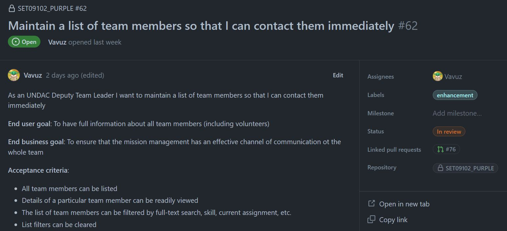
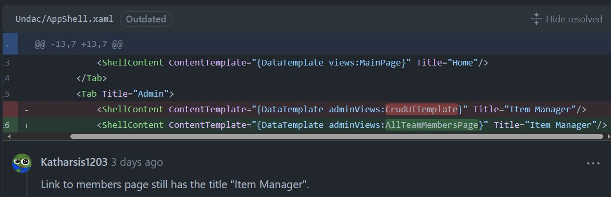
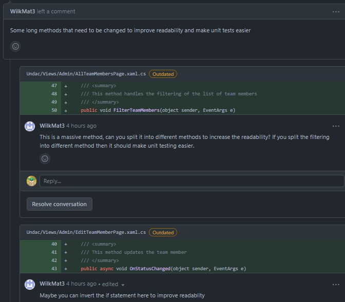
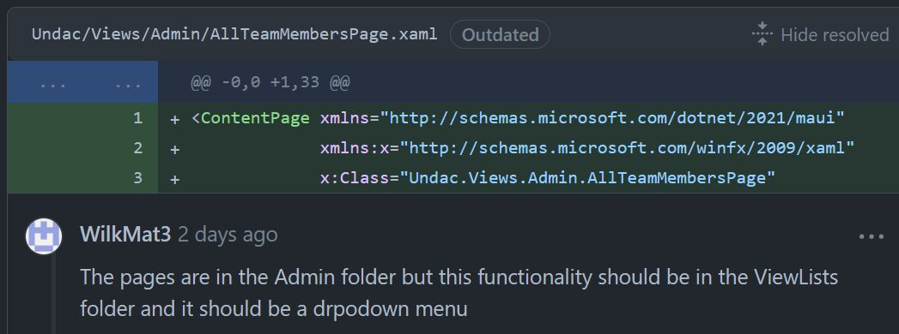
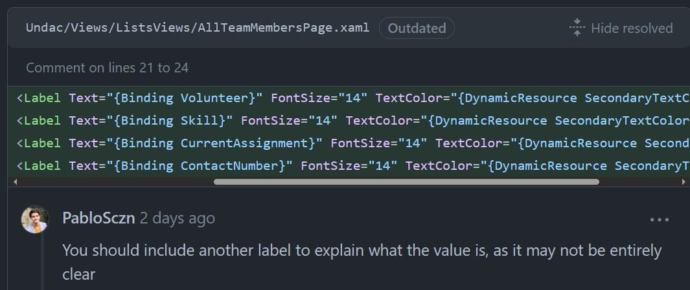
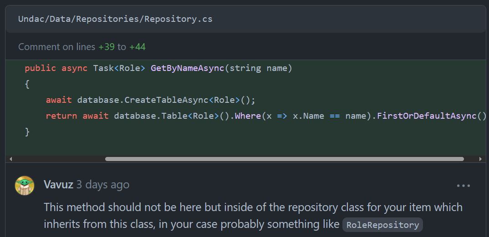
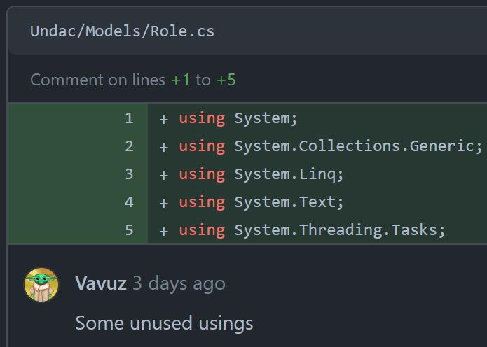
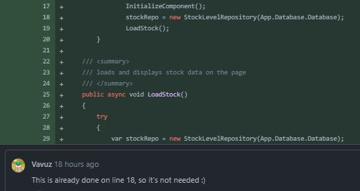
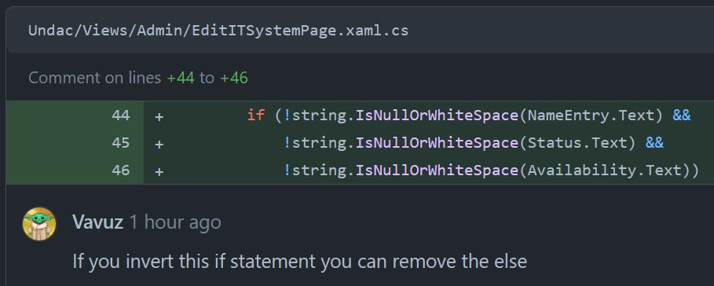

# Project work 2

This document aims to describe the work done during week nine, which consisted in bringing together all the principles and techniques of software engineering that we had learnt, and use them to complete an issue, test it, solve the comments it received, and finally review someone else's code.

---
<br>

## My issue

As things got a little bit easier to be worked on thanks to the efforts of me and my team, pair programming was not necessary this week, during which I completed the task by myself. After having a look through the list of issues provided by the professor I decided to pick the following:

<figure>
  
  <figcaption align="center" style="font-size:11px;"><b>Fig.1 - My issue</b></figcaption>
</figure>

The aim of this issue (https://github.com/xinjoonha/SET09102_PURPLE/issues/62) is to create a UI that will allow an UNDAC Deputy Team Leader to look through a list of team members so he/she can contact them. To be more specific the issue has four acceptance:
- All the team members should be **displayed** in a list view in the page.
- The details should be able to be viewed clearly
- The list of all the team members should be allowed to be filtered by **full text**, by **skill** of the team member and by **current assignment**.
- The filters that can be applied can also be easily cleared.
<br><br>

## The code

The implementation of this issue consisted in 3 main steps, exactly like the previous week, but this time it took me way less time, and I think this will gradually get better in the future three weeks. The <span style="color:orange">first one</span> was to **create a TeamMember class** that could be used around the codebase and then write the code that makes it possible to **write, read and delete items** from an SQLite database.<br>
For simplicity I will omit the Doxygen comments, however the full code can be visualised on my pull request: My PR is ready for approvals
https://github.com/xinjoonha/SET09102_PURPLE/pull/76.<br>
The first snippet shows the `TeamMember` class which inherits from `IIdentifiable` and contains all the necessary well formatted properties.

```cs
[Table("team_member")]
public class TeamMember : IIdentifiable
{
    [PrimaryKey, AutoIncrement]
    public int Id { get; set; }
    public string Name { get; set; }
    public bool Volunteer { get; set; }
    public string Skill { get; set; }
    public string CurrentAssignment { get; set; }
    public string ContactNumber { get; set; }
}
```

Following the implementaion of the **Repository Pattern** which can be read on the previous portfolio, for the code to work I needed to add an interface repository and a repository, `TeamMemberRepository` in this case:

```cs
// Interface
public interface ITeamMemberRepository : IRepository<TeamMember> { }

// Class
public class TeamMemberRepository : Repository<TeamMember>, ITeamMemberRepository
{
    public TeamMemberRepository(SQLiteAsyncConnection database) : base(database) { }
}
```

The <span style="color:orange">second step</span> was to create **a page to visualise those team members and one to edit** the team member's information. Since we are trying to unifying our codebase and use the same things I decided to use the same template as last week with a little change, I added a button to add items. Once again, after solving the review comments which we'll see later, I obtained a class with short, useful and clear methods, essential in software development:

```cs
public partial class AllTeamMembersPage : ContentPage
{
    private List<TeamMember> allTeamMembers;
    private readonly ITeamMemberRepository teamMembersRepo;

    public AllTeamMembersPage()
    {
        InitializeComponent();
        teamMembersRepo = new TeamMemberRepository(App.Database.Database);

        // Attach event handlers for filtering
        FullTextSearchBar.TextChanged += FilterTeamMembers;
        SkillSearchBar.TextChanged += FilterTeamMembers;
        CurrentAssignmentSearchBar.TextChanged += FilterTeamMembers;
    }

    private async void LoadAllTeamMembers()
    {
        var teamMembers = await teamMembersRepo.GetAllAsync();
        allTeamMembers = teamMembers;
        TeamMembersListView.ItemsSource = allTeamMembers;
    }

    protected override void OnAppearing()
    {
        base.OnAppearing();
        LoadAllTeamMembers();
    }

    public void FilterTeamMembers(object sender, EventArgs e)
    {
        var filteredTeamMembers = ApplyFilters(allTeamMembers);
        TeamMembersListView.ItemsSource = filteredTeamMembers;
    }

    public List<TeamMember> ApplyFilters(List<TeamMember> allTeamMembers)
    {
        if (!string.IsNullOrWhiteSpace(FullTextSearchBar.Text))
        {
            string skillFilter = FullTextSearchBar.Text.ToLower();
            allTeamMembers = allTeamMembers.Where(teamMember => teamMember.Name.ToLower().Contains(skillFilter) ||
            teamMember.Skill.ToLower().Contains(skillFilter) ||
            teamMember.CurrentAssignment.ToLower().Contains(skillFilter) ||
            teamMember.ContactNumber.ToLower().Contains(skillFilter)).ToList();
        }
        if (!string.IsNullOrWhiteSpace(SkillSearchBar.Text))
        {
            string locationFilter = SkillSearchBar.Text.ToLower();
            allTeamMembers = allTeamMembers.Where(teamMember => teamMember.Skill.ToLower().Contains(locationFilter)).ToList();
        }
        if (!string.IsNullOrWhiteSpace(CurrentAssignmentSearchBar.Text))
        {
            string locationFilter = CurrentAssignmentSearchBar.Text.ToLower();
            allTeamMembers = allTeamMembers.Where(teamMember => teamMember.CurrentAssignment.ToLower().Contains(locationFilter)).ToList();
        }

        return allTeamMembers;
    }

    private async void AddTeamMember_Clicked(object sender, EventArgs e)
    {
        await Navigation.PushAsync(new EditTeamMemberPage(null, teamMembersRepo));
    }

    private async void OnTeamMemberClicked(object sender, ItemTappedEventArgs e)
    {
        if (e.Item is TeamMember teamMember)
        {
            await Navigation.PushAsync(new EditTeamMemberPage(teamMember, teamMembersRepo));
        }
    }
}
```

Below is the page dedicated to the editing of the Team member's details, which is a bit more detailed compared to last week. As you can see it is also used both for creation of a team member and for editing of a team member, so that we don't have any duplicated code:

```cs
public partial class EditTeamMemberPage : ContentPage
{
    private TeamMember teamMember;
    private readonly ITeamMemberRepository _teamMembersRepo;

    public EditTeamMemberPage(TeamMember teamMember, ITeamMemberRepository teamMembersRepo)
    {
        InitializeComponent();

        this.teamMember = teamMember;
        _teamMembersRepo = teamMembersRepo;

        // Checking whether we are creating or editing a team member
        if (teamMember == null)
        {
            Title = "Create Team Member";
        }
        else
        {
            NameEntry.Text = teamMember.Name;
            VolunteerSwitch.IsToggled = teamMember.Volunteer;
            SkillEntry.Text = teamMember.Skill;
            CurrentAssignmentEntry.Text = teamMember.CurrentAssignment;
            ContactNumberEntry.Text = teamMember.ContactNumber;
        }
    }

    public async void OnStatusChanged(object sender, EventArgs e)
    {
        if (string.IsNullOrWhiteSpace(NameEntry.Text) ||
            string.IsNullOrWhiteSpace(SkillEntry.Text) ||
            string.IsNullOrWhiteSpace(CurrentAssignmentEntry.Text) ||
            string.IsNullOrWhiteSpace(ContactNumberEntry.Text))
        {
            await DisplayAlert("Error", "One of the fields is missing", "OK");
            return;
        }
   
        // Team member is null if we are creating one
        teamMember ??= new TeamMember();

        teamMember.Name = NameEntry.Text;
        teamMember.Volunteer = VolunteerSwitch.IsToggled;
        teamMember.Skill = SkillEntry.Text;
        teamMember.CurrentAssignment = CurrentAssignmentEntry.Text;
        teamMember.ContactNumber = ContactNumberEntry.Text;

        await _teamMembersRepo.SaveAsync(teamMember);
        await Navigation.PopAsync();
    }
}
```

Finally the <span style="color:orange">third step</span> was to **register the pages and the database as services** in the MauiProgram class, that way they are only instanciated once, using Singleton, and they can be injected where needed, but this is something that always needs to be done and that I also showed in the previous portfolio, therefore there is no need to show it in this one nor in the upcoming ones. <br><br>

## The tests

Using the last week's test as guideline, I managed to write a fair ammount of tests to test the basic functionalities of the CRUD operations for the `TeamMember` objects.
The test class is almost the same as last week's with a `OneTimeSetUpAsync()` method for setup, a `TearDownA()` method that deletes the dummy database and 4 more test:
- `AddTeamMemberTestAsync()` creates a mock object and saves it to the database, gets it back from the database and checks that it is the object we just added.
- The `AddInvalidTeamMemberTestAsync()` creates an invalid mock object and tries to save it to the database, gets the item from the database and checks that it is null.
- `DeleteTeamMemberTestAsync()` creates a mock object and saves it to the database, deletes the item, gets the items from the database and checks that it is null.
- `GetTeamMemberTestAsync()` creates two mock objects and saves them to the database, gets all the items from the database and checks that the two that we just added are there.

```cs
[TestFixture]
public class TeamMemberCrudTests
{
    private UndacDatabase _database;
    private string testDatabasePath;
    private ITeamMemberRepository repo;

    [OneTimeSetUp]
    public async Task OneTimeSetUpAsync()
    {
        // Create a test database file path within your unit test project
        testDatabasePath = Path.Combine(TestContext.CurrentContext.TestDirectory, "TestFiles", "TestDB.db3");

        // Create an instance of UndacDatabase using the test database path
        _database = new UndacDatabase(testDatabasePath);
        await _database.Init();
        repo = new TeamMemberRepository(_database.Database);
    }

    [OneTimeTearDown]
    public void TearDownA()
    {
        Directory.Delete(testDatabasePath);
    }

    [Test]
    public async Task AddTeamMemberTestAsync()
    {
        var testTeamMember = new TeamMember {...}

        await repo.SaveAsync(testTeamMember);

        TeamMember readTeamMember = await repo.GetAsync(testTeamMember.Id);
        Assert.That(readTeamMember, Is.Not.Null, " Test Team Member was not saved");
        Assert.That(readTeamMember.Name, Is.EqualTo(testTeamMember.Name), " Test Team Member name not matching");
    }

    [Test]
    public async Task AddInvalidTeamMemberTestAsync()
    {
        var testTeamMember = new TeamMember
        {
            Name = "Invalid invalid",
            Skill = "Nothing",
            Volunteer = false,
            CurrentAssignment = "",
            ContactNumber = "8888876543"
        };
        await repo.SaveAsync(testTeamMember);

        TeamMember readTeamMember = await repo.GetAsync(testTeamMember.Id);
        Assert.That(readTeamMember, Is.Null, " Test Team Member was saved");
    }

    [Test]
    public async Task DeleteTeamMemberTestAsync()
    {
        var testTeamMember = new TeamMember {...}

        await repo.SaveAsync(testTeamMember);

        await repo.DeleteAsync(await repo.GetAsync(testTeamMember.Id));
        var readTeamMemberTwo = await repo.GetAsync(testTeamMember.Id);

        Assert.That(readTeamMemberTwo, Is.Null, " Test TeamMember was not deleted");
    }

    [Test]
    public async Task GetTeamMemberTestAsync()
    {
        var testTeamMember = new TeamMember {...}
        var testTeamMemberTwo = new TeamMember {...}

        await repo.SaveAsync(testTeamMember);
        await repo.SaveAsync(testTeamMemberTwo);

        var teamMembertList = await repo.GetAllAsync();
        var teamMemberOne = teamMembertList.FirstOrDefault(teamMember => teamMember.Name == testTeamMember.Name);
        var teamMemberTwo = teamMembertList.FirstOrDefault(teamMember => teamMember.Name == testTeamMemberTwo.Name);

        Assert.That(teamMemberOne.Name, Is.EqualTo(testTeamMember.Name), "The first test team member was not retrieved");
        Assert.That(teamMemberTwo.Name, Is.EqualTo(testTeamMemberTwo.Name), "The second test team member was retrieved");
    }
}
```
<br><br>

## The review

This week I got more comments compared to last week, but that does not mean that I did a worse job! As I will mention in the conclusion the increased amount of people working on the project made a difference. Below you can see the four comments that my PR got:

<figure>
  
  <figcaption align="center" style="font-size:11px;"><b>Fig.2 - Comment on my PR</b></figcaption>
</figure>

My teammate pointed out a distraction in the figure above, I copy pasted the line above but forgot to change the `Title` attribute, sometimes these things happen, it's good to have someone with a sharp eye who can spot these mistakes out.

<figure>
  
  <figcaption align="center" style="font-size:11px;"><b>Fig.3 - Comment on my PR</b></figcaption>
</figure>

Above we actually have two comments. In the first one WilkMat points out that the method is slightly long and could be split in an other method, so I did it and created a method called `ApplyFilters()` which you can see in the `AllTeamMembersPage` class, after that the code looked much better.<br>
The other thing to fix was an if statement, according to him, inverting it would have made the code look neater, so I applied the change, as it is possible to see in the `OnStatusChanged()` method, so I could remove the else clause. Below you can see what the method previously looked like:

```cs
public async void OnStatusChanged(object sender, EventArgs e)
{
    if (!string.IsNullOrWhiteSpace(NameEntry.Text) &&
        !string.IsNullOrWhiteSpace(SkillEntry.Text) &&
        !string.IsNullOrWhiteSpace(CurrentAssignmentEntry.Text) &&
        !string.IsNullOrWhiteSpace(ContactNumberEntry.Text))
    {
        // Team member is null if we are creating one
        teamMember ??= new TeamMember();

        teamMember.Name = NameEntry.Text;
        teamMember.Volunteer = VolunteerSwitch.IsToggled;
        teamMember.Skill = SkillEntry.Text;
        teamMember.CurrentAssignment = CurrentAssignmentEntry.Text;
        teamMember.ContactNumber = ContactNumberEntry.Text;

        await _teamMembersRepo.SaveAsync(teamMember);
        await Navigation.PopAsync();
    }
    else
        await DisplayAlert("Error", "One of the fields is missing", "OK");
}
```

<figure>
  
  <figcaption align="center" style="font-size:11px;"><b>Fig.4 - Comment on my PR</b></figcaption>
</figure>

One more comment from WilkMat in figure 4 states that my organisation of the folders was wrong, that my new pages should have been added to the ViewsLists folder and not to the Admin one, so I quickly amended that and pushed my code, as you can see below:

```xml
<ContentPage xmlns="http://schemas.microsoft.com/dotnet/2021/maui"
             xmlns:x="http://schemas.microsoft.com/winfx/2009/xaml"
             x:Class="Undac.Views.ListsViews.AllTeamMembersPage"
             BackgroundColor="{DynamicResource PageBackgroundColor}"
             Padding="16"
             Title="Manage Team Members">
```

<figure>
  
  <figcaption align="center" style="font-size:11px;"><b>Fig.5 - Comment on my PR</b></figcaption>
</figure>

Finally there was only one thing left to fix, PabloSczn mentioned that the listview in the UI, containing all the items, was not very clear. To be more precise he could not tell what the attributes below each team member name meant as they did not have a label. As the comment suggests, I just added a label to show the actual meaning of each attribute:

```xml
<StackLayout Margin="0,10,0,10" Padding="10" BackgroundColor="{DynamicResource ListItemBackgroundColor}">
    <Label Text="{Binding Name}" FontAttributes="Bold" FontSize="16" TextColor="{DynamicResource PrimaryTextColor}" />
    <StackLayout Orientation="Horizontal" Spacing="5">
        <Label Text="Volunteer: " FontSize="14" TextColor="{DynamicResource SecondaryTextColor}" />
        <Label Text="{Binding Volunteer}" FontSize="14" />
    </StackLayout>
    <StackLayout Orientation="Horizontal" Spacing="5">
        <Label Text="Skill: " FontSize="14" TextColor="{DynamicResource SecondaryTextColor}" />
        <Label Text="{Binding Skill}" FontSize="14" />
    </StackLayout>
    <StackLayout Orientation="Horizontal" Spacing="5">
        <Label Text="Current Assignment: " FontSize="14" TextColor="{DynamicResource SecondaryTextColor}" />
        <Label Text="{Binding CurrentAssignment}" FontSize="14" />
    </StackLayout>
    <StackLayout Orientation="Horizontal" Spacing="5">
        <Label Text="Contact Number: " FontSize="14" TextColor="{DynamicResource SecondaryTextColor}" />
        <Label Text="{Binding ContactNumber}" FontSize="14" />
    </StackLayout>
</StackLayout>
```

---
<br><br>

## My code review

This week I managed to spot some interesting mistakes and code smells.

<figure>
  
  <figcaption align="center" style="font-size:11px;"><b>Fig.6 - My comment on wrong implementation</b></figcaption>
</figure>

In figure six we can see the worst mistake that I spotted this week. It is very likely that my teammate simply did not understand how the Repository pattern that was implemented the week before works. Instead of creating a separate Repository class for his implementation he modified the `Repository` class itself, which should not be touched.<br>
Of course I reached out to him and made sure that he knew how to proceed with the implementation, and offered my help as a good team member should do.

<figure>
  
  <figcaption align="center" style="font-size:11px;"><b>Fig.7 - My comment on unused usings</b></figcaption>
</figure>

Above is a very simple comment which I also made last week, unused statements should be removed, it is not necessary but it is suggested.

<figure>
  
  <figcaption align="center" style="font-size:11px;"><b>Fig.8 - My comment on duplicated code</b></figcaption>
</figure>

I managed to spot an example of duplicated code, as it is possible to see line 18 creates a Repository object which is created again on line 29 in a try catch block. That is totally not needed, one time is enough.

<figure>
  
  <figcaption align="center" style="font-size:11px;"><b>Fig.9 - My comment on inverting if</b></figcaption>
</figure>

Finally a great example of improvement. In fact I used what I learnt form the comments that I received on my PR to spot this issue, which was almost the same as the one on my PR. I suggested that inverting the if would help remove the else clause. 

---
<br><br>

## Reflection

There are a few things to consider after this second week of project work:
- Because the codebase got easier and easier to read and more functional we got **more people** from our team to write and push code, so we had more code to review and more people to review our code. In fact as you can see the quality of the comments on my PR and the ones provided by me, is notably higher compared to last week. 
- Also before starting to work on the new issue one of my teammates added a fix (one of many) to the main branch, it was about adding some extra validation to the idProperty and replacing the search query with the `FindAsync()` method from within the `GetAsync()` method, so it would be easier to test. This shows the team effort to have organised and fully functioning code in the group project repository.
- While everyone would think that this kind of approach to software engineering would help avoiding the repetition of previous mistakes, because I did not get really good comments on my last PR I can't really tell whether my code quality has improved or not, but I can definitely say that completing the task **required significantly less time**, about one hour, because of the improvements that we made in the past two weeks to the group repository and because of the familiarity that I now have with this type of implementation.
- I would like to add that it is not all about improving code quality, but also about **improving everything that revolves around it** in the software development process, so reviewing code, addressing comments, correctly managing the pull requests, following the workflow, helping the team etc. I can say that this was achieved, as you can see from all the examples above. Improvements were also made on the test coverage, nothing impressive, as just one test for invalid objects was added, but this could lead to a future test enrichment.
- As a team we spoke about **changing the workflow** so it would be easier to merge the PRs but in the end we did not do it as this portfolio was quite a requiring task and we did not have much time to do that too, it might be a task for next week though, as well as the UI standardisation.
- Overall a great week, there are surely many factors that I can work on to improve my developer skills, but this experience should also aim at making me a better student. For example I can see that **my writing skills are improving** week after week, for the future weeks I aim to improve the time needed to write the portfolios.